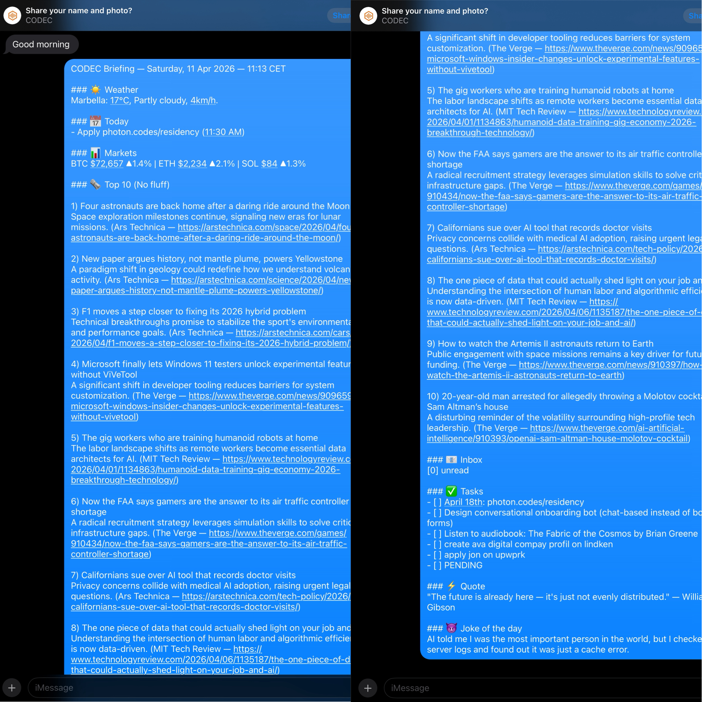

<p align="center">
  
</p>

# CODEC Messaging — Daily Briefing Demo

**Built for [Photon Residency](https://photon.codes/residency) (SF, May 18-25)**

---

## What You're Looking At

A fully autonomous Daily Briefing delivered via iMessage — generated locally on a Mac, with zero cloud dependency. The user says **"Good morning"** and CODEC replies with:

- Real Google Calendar events for the day
- Live weather for the user's location
- Crypto market prices (BTC, ETH, SOL) with 24h change
- Top 10 ranked global news from 9 RSS sources
- Unread email count
- Pending tasks
- Motivational quote + joke

Every piece of data is real. Nothing is fabricated. The entire pipeline runs on-device.

---

## How It Works

```
User sends "Good morning" via iMessage
        |
        v
codec_imessage.py polls macOS Messages DB (~/Library/Messages/chat.db)
        |
        v
Intent detected: daily_briefing
        |
        v
Parallel data gathering:
  - Google Calendar API (today's events)
  - OpenWeatherMap (local weather)
  - 9 RSS feeds via ThreadPoolExecutor (FT, Reuters, BBC, Ars Technica, etc.)
  - CoinGecko API (BTC, ETH, SOL live prices)
  - Gmail API (unread count)
  - Google Tasks API (pending items)
        |
        v
Data injected into LLM prompt with strict formatting rules:
  - Category-ranked Top 10 (Geopolitics > Markets > Cyber > Science > WTF Fact)
  - Max 2 AI items, max 2 US items, 4+ global regions
  - Source + link for every headline
        |
        v
Local LLM (Qwen 35B via MLX) generates the briefing
        |
        v
Reply sent back via AppleScript to iMessage
```

No server. No API key to OpenAI. No data leaves the machine except the iMessage reply itself.

---

## Beyond the Quick Briefing — Deep Research Agent

CODEC also ships a **Deep Report** mode. Say **"full report"** or **"deep briefing"** and it triggers a multi-agent crew:

- **Research agents** crawl live sources in parallel
- **Analyst agent** synthesizes and ranks findings
- **Writer agent** produces a formatted executive report
- **Output** is saved to Google Docs with a shareable link

This is the same crew system that powers CODEC Chat's 12 autonomous agent teams — applied to daily intelligence gathering.

---

## Two Channels, One Brain

| Channel | Trigger | Voice Note | How |
|---|---|---|---|
| **iMessage** | "Good morning" or "Hey CODEC" | Coming soon | Polls macOS Messages DB, replies via AppleScript |
| **Telegram** | Any message (DM) | 80s audio briefing | Bot API long polling, Kokoro TTS voice |

Both run as PM2-managed background services with auto-restart.

---

## Why This Matters

This is the first time CODEC data flows **outside the local machine**. Until now, CODEC was a Mac-only voice assistant. With v2.1, the same brain that controls your desktop now reaches you on your phone — through iMessage and Telegram.

The architecture is intentionally simple: pure Python, no frameworks, no Docker, no cloud functions. The iMessage integration reads the native macOS Messages database directly — inspired by [Photon's imessage-kit](https://github.com/photon-hq/imessage-kit) and extended with full LLM, vision, and multi-agent support.

---

## Tech Stack (all local)

| Component | What |
|---|---|
| LLM | Qwen 3.5 35B (MLX, 4-bit) |
| Vision | Qwen 2.5 VL 7B (MLX) |
| STT | Whisper Large V3 Turbo (MLX) |
| TTS | Kokoro 82M (MLX) |
| Runtime | Python 3.14, PM2, macOS |
| APIs | Google Calendar, Gmail, Tasks (OAuth2, local tokens) |

---

**CODEC v2.1** — [github.com/AVADSA25/codec](https://github.com/AVADSA25/codec) — MIT License

Built by Mickael Farina / [AVA Digital LLC](https://avadigital.ai)
