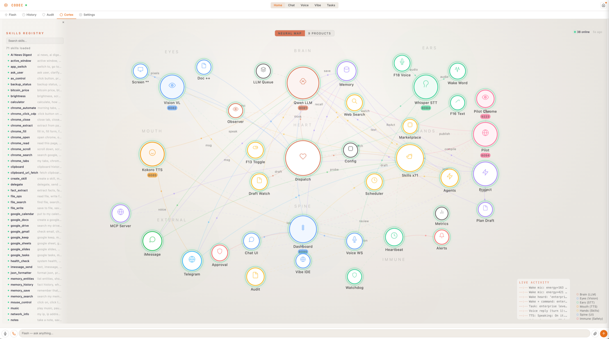
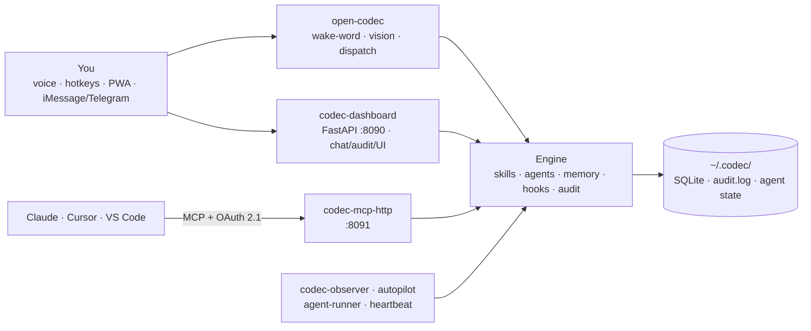

<p align="center">
  
</p>

<h1 align="center">Sovereign AI Workstation</h1>
<p align="center"><strong>The open-source AI workstation for macOS, powered by CODEC</strong></p>
<p align="center"><em>Your voice. Your computer. Your rules.</em></p>
<p align="center">
  <a href="https://avadigital.ai">avadigital.ai</a> · <a href="https://opencodec.org">opencodec.org</a> · <a href="#quick-start">Get Started</a> · <a href="#support-the-project">Support</a> · <a href="#professional-setup">Enterprise</a>
</p>

<p align="center">
  <strong>CODEC turns a Mac into a voice-controlled AI workstation that runs 100% on your machine.</strong><br/>
  Speak. See the screen. Click anywhere by voice. Run agent crews. Plug into Claude, Cursor, or VS&nbsp;Code as an MCP server — and let them drive your Mac back.<br/>
  <em>Open source · MIT · no cloud required.</em>
</p>

<p align="center">
  <a href="https://github.com/AVADSA25/codec/actions/workflows/ci.yml"></a>
  <a href="https://github.com/AVADSA25/codec/discussions"></a>
  <a href="FEATURES.md"></a>
  
  
  
  
  
</p>

---

<p align="center">
  <a href="https://www.youtube.com/watch?v=OEXxvxA0_AE">
    
  </a>
  <br/>
  <em>Watch the full demo</em>
</p>

---

## What This Is

**Sovereign AI Workstation** turns a Mac into a voice-controlled AI workstation that you fully own. Give it a brain (any LLM — local or cloud), ears (Whisper), a voice (Kokoro), and eyes (a vision model). The rest is Python.

It listens, sees the screen, speaks back, controls apps, writes code, drafts messages, manages Google Workspace — and when it doesn't know how to do something, it writes its own plugin and learns.

No cloud dependency. No data leaving the machine unless you choose. No subscription on the open-source build. MIT licensed.

> **Sovereign AI Workstation** is the product brand. **CODEC** (v3.1) is the open-source engine that powers it — the codename you'll see in code paths, skill registries, the `codec_*` PM2 services, and the `~/.codec/` config directory. *Sovereign AI Workstation* is what you ship; *CODEC* is what you ship with. Same way iPhone runs on Darwin, or Tesla Model S runs on Roadster components — one is the product, the other is the engine.

---

## Why CODEC, not the alternatives

CODEC's moat is the *combination* — local-first **and** voice **and** MCP-as-a-server **and** self-writing skills **and** a zero-dependency agent runtime. No single competitor has all five.

- **Open Interpreter / Aider write code in a terminal. CODEC controls the whole Mac by voice** — including your IDE, your browser, your apps. The terminal is one surface; CODEC drives all of them.
- **Cursor and Claude Desktop talk to LLMs. CODEC turns your Mac into a tool the LLM can use** — over MCP. Claude (or Cursor, or VS Code) gets your screen, your apps, your 76 skills, and your memory. CODEC is both an MCP *client* and an MCP *server*, so two CODECs can even peer — agent-to-agent — on the open protocol Anthropic standardized.
- **CrewAI / LangChain orchestrate. CODEC orchestrates _and_ executes on your hardware** — with a ~795-line multi-agent runtime that has zero dependency on either framework.

And all of it runs on *your* machine: no data leaves unless you explicitly route a request through a cloud model.

---

## 9 Products. One System.

| # | Product | What It Does |
|:-:|---|---|
| 1 | **CODEC Core** | Voice command layer + vision mouse control — 75 skills, screen clicks by voice |
| 2 | **CODEC Dictate** | Hold, speak, paste — hands-free F5 live typing at cursor, draft refinement, floating overlays |
| 3 | **CODEC Instant** | Right-click → 8 AI services system-wide — proofread, translate, reply, explain |
| 4 | **CODEC Chat** | 250K-context conversational AI + 12 autonomous agent crews |
| 5 | **CODEC Vibe** | Browser IDE with Monaco editor + live preview — new skills land through a human-review approval flow |
| 6 | **CODEC Voice** | Real-time voice calls with interrupt detection, screen analysis mid-call |
| 7 | **CODEC Overview** | Dashboard + Cortex nerve center + full audit trail — accessible from any device |
| 8 | **CODEC Pilot** | Browser automation you can *teach* — record once, replay forever with XPath→CSS→LLM rescue |
| 9 | **CODEC Project** | Drop-a-project autonomy — describe what to build, approve the plan once, daemon executes for hours |

---

### 1. CODEC Core — The Command Layer

Always-on voice assistant. Say *"Hey CODEC"* or press F13 to activate. F18 for voice commands. F16 for text input.

75 skills fire instantly: Google Calendar, Gmail, Drive, Docs, Sheets, Tasks, Keep, Chrome automation, web search, Hue lights, timers, Spotify, clipboard, terminal commands, PM2 control, and more. Most skills bypass the LLM entirely — direct action, zero latency. Skills are matched by trigger specificity — longer, more specific triggers always win over generic ones.

**Vision Mouse Control — See & Click**

No other open-source voice assistant does this. Say *"Hey CODEC, click the Submit button"* — CODEC screenshots the screen, sends it to a local UI-specialist vision model (UI-TARS), gets back pixel coordinates, and moves the mouse to click. Fully voice-controlled. Works on any app. No accessibility API required — pure vision.

| Step | What happens | Speed |
|---|---|---|
| 1 | Whisper transcribes voice command | ~2s |
| 2 | Target extracted from natural speech | instant |
| 3 | Screenshot captured and downscaled | instant |
| 4 | UI-TARS locates the element by pixel coordinates | ~4s |
| 5 | pyautogui moves cursor and clicks | instant |

*"I'm on Cloudflare and can't find the SSL button — click it for me."* That works. CODEC strips the conversational noise, extracts "SSL button", and finds it on screen.

### 2. CODEC Dictate — Hold, Speak, Paste

Hold Cmd+R. Say what you mean. Release. Text appears wherever the cursor is. Tap **F5** for hands-free live typing — words appear at the cursor in real-time as you speak, continuously, with a visible `LIVE · press F5 to stop` pill top-center. Tap F5 again to stop.

If CODEC detects a message draft, it refines through the LLM — grammar fixed, tone polished, meaning preserved. Works in every app on macOS. A free, open-source SuperWhisper replacement that runs entirely local.

Native floating overlays: orange-bordered recording panel with pulsing red dot, blue processing indicator, red live-typing pill. Pipelined producer/consumer recording ensures zero audio is dropped between chunks. Paste via CGEventPost keeps focus in your clicked field (no URL-bar hijack). English-pinned Whisper prevents auto-translation. Built-in hallucination filter blocks Whisper noise artifacts. atexit + SIGTERM cleanup prevents orphaned subprocesses.

### 3. CODEC Instant — One Right-Click

Select any text, anywhere. Right-click. Eight AI services system-wide: Proofread, Elevate, Explain, Translate, Reply (with `:tone` syntax), Prompt, Read Aloud, Save. Powered by the local LLM.

### 4. CODEC Chat — 250K Context + 12 Agent Crews + Drop-a-Project Autonomy

Full conversational AI. Long context. File uploads (drag-and-drop). Image analysis via vision model. Web search. Persistent conversation history with sidebar. Edit and re-send messages. Regenerate responses.

Voice input via continuous microphone with stop button. Streaming responses with typing and thinking indicators.

**Four modes** in the chat composer: **Chat / Think / Agents / Project**. The first three live here — Project mode is documented as its own product in [§9 below](#9-codec-project--drop-a-project-autonomy) since it runs autonomously on a dedicated daemon for hours rather than turn-by-turn in the chat thread.

Plus 12 autonomous agent crews — not single prompts, full multi-step workflows. Say *"research the latest AI agent frameworks and write a report."* Minutes later there's a formatted Google Doc in Drive with sources, images, and recommendations.

| Crew | Output |
|---|---|
| Deep Research | 10,000-word illustrated report → Google Docs |
| Daily Briefing | Morning news + calendar → Google Docs |
| Competitor Analysis | SWOT + positioning → Google Docs |
| Trip Planner | Full itinerary → Google Docs |
| Email Handler | Triage inbox, draft replies |
| Social Media | Posts for Twitter, LinkedIn, Instagram |
| Code Review | Bugs + security + clean code |
| Data Analysis | Trends + insights report |
| Content Writer | Blog posts, articles, copy |
| Meeting Summarizer | Action items from transcripts |
| Invoice Generator | Professional invoices |
| Custom Agent | Define your own role, tools, task |

Schedule any crew: *"Run competitor analysis every Monday at 9am"*

The multi-agent framework is under 800 lines. Zero dependencies. No CrewAI. No LangChain. 7 built-in tools including web search, file operations, Google Docs, image generation, and vision.

**Phase 3 substrate** (autonomous agents) reuses Phase 1+2 components: unified audit envelope (Step 1), plugin lifecycle hooks (Step 2), AskUser + strict-consent + step budget (Step 3), continuous observation loop (Step 5), trigger system (Step 6), end-of-day shift report (Step 7). Per-agent state at `~/.codec/agents/<id>/`. Global allowlist tier at `~/.codec/agent_global_grants.json`. 17 new audit events. See `docs/PHASE3-COMPLETE.md` for the full sign-off.

### 5. CODEC Vibe — AI Coding IDE

Split-screen in the browser. Monaco editor on the left (same engine as VS Code, v0.45.0). AI chat on the right. Describe what's needed — CODEC writes it, click Apply, run it, live preview in browser.

New skills land through the human-review approval flow (`/api/skill/review` → `/api/skill/approve`) — staged, previewed, then written to disk only after explicit operator approval. Defense in depth pairs with the load-time AST gate in `SkillRegistry.load`. DOMPurify sanitization on all rendered content.

### 6. CODEC Voice — Live Voice Calls

Real-time voice-to-voice conversations with the AI. WebSocket pipeline with auto-reconnect (exponential backoff), heartbeat keepalive, and interrupt detection — no Pipecat, no external dependencies.

Call CODEC from a phone, talk naturally, and mid-call say *"check my screen"* — it takes a screenshot, analyzes it, and speaks the result back. Interrupt-safe: if you speak while vision is processing, it stops immediately instead of playing stale results. Voice Replies toggle (ON/OFF) persists across all pages. TTS dedup guard prevents duplicate audio playback.

Full transcript saved to memory. Every conversation becomes searchable context for future sessions. VAD thresholds (silence, duration, echo cooldown) fully configurable via `config.json`.

### 7. CODEC Overview — Dashboard, Cortex & Audit

Private dashboard accessible from any device, anywhere. Cloudflare Tunnel or Tailscale VPN — no port forwarding, no third-party relay. 135+ API endpoints. Send commands, view the screen, launch voice calls, manage agents — all from a browser. Installable as a PWA on mobile and desktop.

**Cortex — System Nerve Center**
Visual command center showing all 9 CODEC products in an interactive grid. Neural network SVG map, real-time activity feed, searchable skills panel, and detailed event log viewer. The single-pane-of-glass view of the entire system.

**Audit — Full Event Trail**
Every action CODEC takes is logged across 16 categories: command, skill, llm, auth, error, scheduled, voice, vision, tts, stt, system, security, hotkey, screenshot, config, draft. Filterable by category pills, searchable, with colored timeline dots and expandable event details. JSON-line storage with 50MB rotation. Default 24h time range with 1h/6h/24h/7d quick filters.

### 8. CODEC Pilot — Browser Automation You Can Teach

Dedicated headless Chromium owned by Pilot (CDP port 9223, separate from your daily Chrome on 9222), driven live by Qwen and visible in the dashboard. Goes well beyond "an LLM with a browser tool" — every successful run compiles into a reusable Python skill that replays deterministically with zero LLM cost on the hot path.

**Three ways to drive it (all from Tasks → Pilot in the dashboard):**

1. **Agent mode** — Type a natural-language task. Qwen takes a snapshot, picks an action, executes, re-snapshots, repeats until done. ReAct loop with 8-action vocabulary (`navigate / click / type / scroll / wait / extract / select_option / done`), 30-step budget, dangerous-URL blocklist, hallucinated-index validation. Watch it work via the live MJPEG feed (~3 fps).
2. **Teach mode** — Hit **● Record**, drive the browser yourself (Navigate / Click [N] / Type into [N] from the UI), hit **■ Stop & Save**. CODEC captures every action with selectors (XPath + CSS + accessible name + ARIA role) and auto-compiles a Python skill awaiting your review.
3. **Replay mode** — Hit ▶ on any past run. Goes through the **3-tier reliability ladder**: XPath (3 attempts × 500 ms backoff) → CSS (1 attempt × 2 s) → LLM rescue (re-snapshot, ask Qwen to find the element by name). Worst case: ~12 s before a stuck step surfaces. Skills self-heal when sites change their DOM.

**Skill approval gate.** Compiled skills do NOT auto-register — they land in `~/.codec/skills/.pending/` and require human approval via the dashboard. Blocks prompt-injection-spawned malicious skills from auto-activating. Approve → moves to `~/.codec/skills/pilot_{slug}.py` with `SKILL_NAME` / `SKILL_DESCRIPTION` / `SKILL_TAGS` metadata; SkillRegistry hot-reloads and the skill is callable from voice, Chat, Scheduler, and any MCP client.

**HITL (human-in-the-loop) takeover.** Pause an agent mid-run, inject manual actions, take full control, then hand back. The agent re-snapshots and continues from wherever you left it.

**Three-tier replay ladder, by the numbers:**

| Tier | Method | Attempts | Per-step latency | Triggers on |
|---|---|---|---|---|
| 1 | Stored XPath | 3 × 500 ms backoff | <100 ms (typical) | Always tried first |
| 2 | Stored CSS selector | 1 × 2 s timeout | ~50 ms | XPath missed all 3 retries |
| 3 | Qwen rescue by name | 1 × 10 s timeout | 1–10 s | XPath + CSS both failed |

**Infrastructure:** Playwright + FastAPI on PM2 (`pilot-runner` on port 8094), 30 endpoints, MJPEG live stream, JSON traces persisted under `~/.codec/pilot_traces/{run_id}/trace.json`, optional Cloudflare tunnel at `pilot.lucyvpa.com`.

Try: *Record yourself logging into Gmail, approve the skill, schedule it to run every morning at 7am — Qwen never touches the hot path again.*

### 9. CODEC Project — Drop-a-Project Autonomy

Where Chat answers and Pilot replays, Project **builds**. Type a project description like *"Build me a Telegram bot that monitors Marbella property listings under €500k"* or *"Watch EUR/USD intraday vol and ping me when 30-min realized vol crosses 0.4%"*, hit send, and a dedicated PM2 daemon (`codec-agent-runner`) executes for hours without supervision — writing files, running commands, calling skills, hitting APIs, until the project is done or it asks you a question.

This isn't "an LLM with bash access." It's the full Phase-3 autonomous-agent substrate: planning, permission gating, persistence, observation, multi-agent concurrency, and a structured intervention protocol. It went through 10 numbered steps and 5 numbered architectural reviews to ship.

**How it works:**

1. **Draft phase.** You type the project description in Chat → **Project** mode. Local Qwen-3.6 reads it and drafts a structured plan as JSON: `goal`, `success_criteria`, `phases`, plus an explicit **permission manifest** declaring which skills it will use, which file paths it will write to, which network domains it will hit, and which destructive operations (delete, force-push) it intends to perform. You see the full plan + manifest before anything runs.
2. **Approval phase.** You approve once. The plan is hashed and pinned — any tampering after approval is detected and refuses to execute (`plan_hash` mismatch).
3. **Execution phase.** `codec-agent-runner` (PM2 daemon, autorestart) picks up the approved plan and runs it autonomously: Qwen ↔ skill loops, permission-gated at every step, with `AskUserQuestion` available for the rare moments the agent genuinely needs you. Long-running agents resume cleanly after machine restart — state persists to `~/.codec/agents/<id>/`.
4. **Intervention phase (optional).** Status pills above the chat input show every running agent live — `running / paused / blocked_on_permission / blocked_on_question / done / failed`. Inline **Approve / Pause / Resume / Abort** buttons. Updates post back into the chat thread as the agent reports progress. You can have **up to 3 agents** running concurrently.

**Phase-3 substrate components** (all live, all wired together):

| Component | What it does |
|---|---|
| **Unified audit envelope** (Step 1) | 17 new event types — every plan-draft, approval, action, permission grant, intervention is JSON-logged |
| **Plugin lifecycle hooks** (Step 2) | Skills can register pre-action/post-action hooks; the runner respects them |
| **AskUserQuestion + strict-consent + step budget** (Step 3) | Agents can pause to ask multiple-choice questions with strict consent gates on destructive ops |
| **Plan persistence** (Step 4) | Every draft, approval, and revision saved — replay history, audit trail |
| **Continuous observation loop** (Step 5) | Agent watches its own progress, detects stuck states, escalates |
| **Trigger system** (Step 6) | External signals (file changes, schedule fires, etc.) can wake agents |
| **End-of-day shift report** (Step 7) | Daily summary of what every agent did, surfaced in the dashboard |
| **Agent planner** (Step 8, `codec_agent_plan.py`) | Qwen-driven plan drafting with permission manifest extraction |
| **Agent runner** (Step 9, `codec_agent_runner.py`) | The PM2 daemon — execution loop, permission enforcement, plan-hash check, multi-agent concurrency |
| **Agent messaging** (Step 9, `codec_agent_messaging.py`) | Reply-queue plumbing — feeds approvals/answers/aborts back into the agent's next turn |

**Permission tiers — two levels of trust:**

- **Per-agent grants.** Each agent has its own permission manifest — only the skills, paths, and domains it explicitly listed at draft time. Anything else triggers a `blocked_on_permission` pause for user approval.
- **Global allowlist** at `~/.codec/agent_global_grants.json` — anything in here is auto-approved for *every* agent. Default ships with read-only access to `~/codec-repo/**` only; you opt in to more.

**Where the state lives:**

```
~/.codec/agents/<agent_id>/
├── plan.json              — the approved plan + manifest + plan_hash
├── state.json             — current phase, step index, in-flight action
├── messages.jsonl         — full conversation history
├── audit.jsonl            — per-agent audit trail (subset of global audit)
└── workspace/             — sandbox the agent writes into
~/.codec/agent_global_grants.json   — global allowlist
~/.codec/audit.log                  — global audit with agent_runner events
```

Try: *"Spec out a new sales tool for tracking Marbella forex prop firms, draft the schema, scaffold a FastAPI service, write 5 example records into a SQLite DB, expose `/leads` and `/leads/{id}` endpoints, then write a README."* CODEC drafts a 4-phase plan with file-write paths, you approve, and an hour later you have a working service.

### iMessage & Telegram

CODEC is already accessible from any device via its dashboard (Cloudflare Tunnel or Tailscale). iMessage and Telegram are additional interfaces for users who prefer messaging.

iMessage reads the macOS Messages DB, watches for *"Hey CODEC"* or *"Good morning"*, and replies via AppleScript. Telegram uses Bot API long polling — no trigger needed in DMs. Both share the same LLM, skills, and conversation memory as the desktop.

**Daily Briefing** — say "Good morning" and receive a full morning report: Google Calendar events, weather, crypto markets, Top 10 ranked news from 9 RSS sources, inbox count, pending tasks, and a quote. On Telegram, this also includes an 80-second voice note. For deeper analysis, say "full report" to trigger the multi-agent Deep Research crew (same as CODEC Chat) — outputs to Google Docs.

<p align="center">
  
  <br/>
  <em>Daily Briefing via iMessage — calendar, markets, ranked news, all generated locally</em>
</p>

Three smart agents ship built-in: Daily Briefing, Restaurant Decider (location-aware dining), and Accountability Coach (goal tracking). Both services run as PM2 processes with auto-restart.

---

## Screenshots

<p align="center">
  <br/>
  <em>Chat — ask anything, drag & drop files, full conversation history</em>
</p>

<p align="center">
  <br/>
  <em>Deep Chat — upload files, select agents, get structured analysis</em>
</p>

<p align="center">
  <br/>
  <em>Voice Call — real-time conversation with live transcript</em>
</p>

<p align="center">
  <br/>
  <em>Vibe Code — describe what you want, get working code with live preview</em>
</p>

<p align="center">
  <br/>
  <em>Deep Research — multi-agent reports delivered to Google Docs</em>
</p>

<p align="center">
  <br/>
  <em>Scheduled automations — morning briefings, competitor analysis, on cron</em>
</p>

<details>
<summary><strong>More screenshots</strong></summary>
<br/>
<p align="center">
  <br/>
  <em>Settings — LLM, TTS, STT, hotkeys, wake word configuration</em>
</p>
<p align="center">
  <br/>
  <em>12 specialized agent crews</em>
</p>
<p align="center">
  <br/>
  <em>Touch ID + PIN + 2FA authentication</em>
</p>
<p align="center">
  <br/>
  <em>Right-click integration — CODEC in every app</em>
</p>
<p align="center">
  <br/>
  <em>75 skills loaded at startup</em>
</p>
<p align="center">
  <br/>
  <em>Cortex — neural map with 28 nodes across 7 zones, live activity feed, config panel</em>
</p>
</details>

---

## What Makes CODEC Different

| Capability | CODEC | Siri / Alexa / Google | ChatGPT / Claude |
|---|---|---|---|
| Controls the computer | Full macOS control | Limited smart home | No |
| Reads the screen | Vision model | No | No |
| Clicks UI elements by voice | Vision + mouse control | No | No (Cloud Computer Use only) |
| Runs 100% local | Yes — all models on device | No | No |
| Voice-to-voice calls | WebSocket, real-time | Yes but cloud | Yes but cloud |
| Multi-agent workflows | 12 crews, local LLM | No | Limited |
| Right-click AI services | 8 system-wide services | No | No |
| Writes its own plugins | Yes, via review-and-approve flow | No | No |
| Hands-free live typing at cursor | Dictate F5 | No | No |
| Process watchdog | Auto-kills stuck processes | No | No |
| Full audit trail | 16 event categories | No | No |
| iMessage + Telegram | Daily Briefing, smart agents, voice notes | No | No |
| Open source | MIT | No | No |

**What CODEC replaced with native code:**

| Before | After (CODEC Product) |
|---|---|
| Pipecat | **Voice** — own WebSocket pipeline |
| CrewAI + LangChain | **Chat** — 795-line agent framework, zero dependencies |
| SuperWhisper / Apple Dictation | **Dictate** — free, open source, F5 hands-free live typing, 100% local |
| Cursor / Windsurf | **Vibe** — Monaco + AI + review-gated skill creation |
| Google Assistant / Siri | **Core** — actually controls the computer |
| Grammarly | **Instant** — right-click services via local LLM |
| ChatGPT | **Chat** — 250K context, fully local |
| Cloud LLM APIs | Local stack (Qwen + Whisper + Kokoro + Vision) |
| Vector databases | FTS5 SQLite (simpler, faster, private) |
| Datadog / Sentry | **Overview** — dashboard + cortex + 16-category audit |

**External services:** DuckDuckGo for web search. Cloudflare free tier for the tunnel (or Tailscale). Everything else runs on local hardware.

---

## Architecture

CODEC is **not a monolith.** It runs as a swarm of small Python processes supervised by PM2 — each with one responsibility, each killable without breaking the others. Services coordinate through atomic JSON writes (`~/.codec/*.json`) and localhost HTTP, never a shared in-memory bus.



- **Inbound stays private** — the only inbound surface is the PWA over a Cloudflare Zero Trust tunnel (or Tailscale). Outbound bridges (Gmail, iMessage, Telegram) are user-owned.
- **Every privileged action is gated and audited** — file/process/network access goes through a sandbox + consent gate and lands in an HMAC-signed `~/.codec/audit.log`.
- **The LLM is swappable** — local Qwen by default; any OpenAI-compatible endpoint (or the paid cloud tier) drops in without touching the skill catalog.

Full runtime topology, process table, and data-flow diagrams: **[docs/ARCHITECTURE.md](docs/ARCHITECTURE.md)**.

---

## Quick Start

```bash
git clone https://github.com/AVADSA25/codec.git
cd codec
./install.sh
```

The setup wizard handles everything in 9 steps: LLM, voice, vision, hotkeys, Google OAuth, remote access, and more.

**Requirements:**
- macOS Ventura or later
- Python 3.10+
- An LLM (Ollama, LM Studio, MLX, or any OpenAI-compatible API)
- Whisper for voice input, Kokoro for voice output, a vision model for screen reading

---

## Supported LLMs

| Model | How to run |
|---|---|
| **Qwen 3.6 35B** (recommended) | `mlx-lm.server --model mlx-community/Qwen3.6-35B-A3B-4bit` |
| **Llama 3.3 70B** | `mlx-lm.server --model mlx-community/Llama-3.3-70B-Instruct-4bit` |
| **Mistral 24B** | `mlx-lm.server --model mlx-community/Mistral-Small-3.1-24B-Instruct-2503-4bit` |
| **Gemma 3 27B** | `mlx-lm.server --model mlx-community/gemma-3-27b-it-4bit` |
| **GPT-4o** (cloud) | `"llm_url": "https://api.openai.com/v1"` |
| **Claude** (cloud) | OpenAI-compatible proxy |
| **Ollama** (any model) | `"llm_url": "http://localhost:11434/v1"` |

Configure in `~/.codec/config.json`:
```json
{
  "llm_url": "http://localhost:8081/v1",
  "model": "mlx-community/Qwen3.6-35B-A3B-4bit"
}
```

---

## Keyboard Shortcuts

| Key | Action |
|---|---|
| F13 | Toggle CODEC ON/OFF |
| F18 (hold) | Record voice → release to send |
| F18 (double-tap) | PTT Lock — hands-free recording |
| F16 | Text input dialog |
| Cmd+R (hold) | Dictate — hold, speak, release to paste |
| F5 | Hands-free live typing — words stream to cursor in real-time; F5 again to stop |
| `* *` | Screenshot + AI analysis |
| `+ +` | Document mode |
| Camera icon | Live webcam PIP — drag around, snapshot anytime |
| Select text → right-click | 8 AI services in context menu |

**Laptop (F1-F12):** F5 = toggle, F8 = voice, F9 = text input. Run `python3 setup_codec.py` → select "Laptop / Compact" in Step 4.

Custom shortcuts in `~/.codec/config.json`. Restart after changes: `pm2 restart open-codec`

---

## Privacy & Security

**6-layer security stack:**

| Layer | Protection |
|---|---|
| Network | Cloudflare Zero Trust tunnel or Tailscale VPN, CORS restricted origins with explicit header whitelist |
| Auth | Touch ID + PIN + TOTP 2FA, timing-safe token comparison, brute-force rate limiting |
| Encryption | AES-256-GCM + ECDH P-256 key exchange, per-session keys, key persistence across restarts |
| Execution | Subprocess isolation, resource limits (512MB RAM, 120s CPU), 46+ dangerous command patterns, human review gate |
| Data | Local SQLite with WAL, parameterized queries, FTS5 full-text search with injection prevention — searchable, private, yours |
| Audit | Full event trail across 16 categories, 50MB rotating JSON-line logs, every action tracked |

Every conversation is stored locally in SQLite with FTS5 full-text search. No cloud sync. No analytics. No telemetry.

**Pilot subsystem hardening (v3.1).** The browser-automation pillar went through a dedicated adversarial security audit (15 findings, remediated PP-1…PP-12): per-request token auth + loopback-only bind, an AST safety gate at skill-approval time, prompt-injection fencing of untrusted page content, SSRF/scheme guards on navigation, destructive-action default-deny on replay, secret redaction in traces, randomized CDP debug port, and a forensic audit trail. 67 security tests cover it.

**Enterprise quality bar.** Single-source-of-truth versioning (the `VERSION` file ← CHANGELOG, CI-pinned), a `ruff` lint gate in CI, 1,300+ tests including dedicated security suites, and reproducible packaging via `pyproject.toml`. Every release is git-tagged.

---

## MCP Server — CODEC Inside Claude, Cursor, VS Code

CODEC exposes tools as an MCP server. Any MCP-compatible client can invoke CODEC skills directly:

```json
{
  "mcpServers": {
    "codec": {
      "command": "python3",
      "args": ["/path/to/codec-repo/codec_mcp.py"]
    }
  }
}
```

Then in Claude Desktop: *"Use CODEC to check my calendar for tomorrow."*

Skills opt-in to MCP exposure with `SKILL_MCP_EXPOSE = True`. Input validation enforces 5KB task / 10KB context limits with type checking on every call.

### Configuring which skills CODEC exposes over MCP

CODEC defaults to **opt-in** — only skills you explicitly allow reach the MCP surface. Three keys in `~/.codec/config.json` control the policy:

| Option | Default | Effect |
|---|---|---|
| `mcp_default_allow` | `false` | When `true`, every skill with `SKILL_MCP_EXPOSE = True` is exposed (opt-out via `mcp_blocked_tools`). When `false` (recommended), nothing is exposed unless listed in `mcp_allowed_tools`. |
| `mcp_allowed_tools` | `[]` | Explicit allowlist of skill names exposed over MCP when `mcp_default_allow` is `false`. Example: `["calculator", "weather", "memory_search"]`. |
| `mcp_blocked_tools` | `["terminal", "process_manager", "pm2_control"]` | Hard blocklist applied on every MCP transport regardless of the above. The HTTP transport adds a stricter built-in blocklist (`python_exec`, `ax_control`) that cannot be overridden. |

Example config snippet:

```jsonc
{
  "mcp_default_allow": false,
  "mcp_allowed_tools": ["calculator", "weather", "memory_search", "google_calendar"],
  "mcp_blocked_tools": ["terminal", "process_manager", "pm2_control"]
}
```

Restart `codec-mcp-http` (HTTP transport) or the host MCP client (stdio transport) after changes.

### What this unlocks (that Claude alone can't do)

Claude Desktop/Code/Cursor gain — through this one MCP bridge — everything CODEC already owns on *your* machine:

- **Your Mac, your apps** — native macOS control: mouse/keyboard via vision model, screenshot text extraction, app switching, clipboard, brightness/volume, Philips Hue, Spotify, Apple Notes, Reminders, Clock timers, music. No browser sandbox.
- **Your memory** — FTS5-searchable history of every CODEC conversation. Claude can recall what *you* said weeks ago, not just this chat.
- **Your skills, not Anthropic's** — 76 pluggable CODEC skills instantly callable as tools. Write one locally in Python, it shows up in Claude without a deploy.
- **Your LLM, your choice** — same skill catalog works whether the brain is local Qwen (offline, private) or cloud Claude. The toolkit outlives the model.
- **Your voice pipeline** — Whisper STT, Kokoro TTS, wake-word — all reachable from the chat loop if you want voice output of a Claude answer.

One install. Claude stops being a chat window and becomes a driver for the machine it's running on.

### Bidirectional MCP — agent-to-agent on the open protocol

CODEC is **both an MCP client and an MCP server.** As a *client* it consumes tools from any MCP host; as an MCP server it exposes its 76 skills, searchable memory, and voice pipeline to any MCP client — Claude, Cursor, VS&nbsp;Code, or **another CODEC.** Point two Macs at each other and they peer directly: **agent-to-agent** collaboration over the same protocol Anthropic standardized — no middleman cloud, each side keeping its own data local.

---

## Debugging & Development

**Recommended tools:**

| Tool | How it helps |
|---|---|
| **[Claude Code](https://claude.ai/claude-code)** | Terminal AI — reads the full codebase, runs commands, fixes errors in context |
| **[Cursor](https://cursor.com)** | AI IDE — navigate CODEC's 230+ files, refactor, debug with full project awareness |
| **[Windsurf](https://windsurf.ai)** | AI IDE — strong at multi-file reasoning |
| **[Antigravity](https://antigravity.dev)** | AI debugging assistant — paste errors, get fixes with codebase context |

**Quick debug commands:**

```bash
# Check all services
pm2 list

# Check specific service logs
pm2 logs open-codec --lines 30 --nostream        # Main CODEC process
pm2 logs codec-dashboard --lines 30 --nostream    # Dashboard API
pm2 logs codec-dictate --lines 10 --nostream      # Dictation hotkeys
pm2 logs codec-watchdog --lines 10 --nostream     # Process watchdog
pm2 logs whisper-stt --lines 10 --nostream        # Speech-to-text
pm2 logs kokoro-82m --lines 10 --nostream         # Text-to-speech
pm2 logs codec-imessage --lines 10 --nostream     # iMessage agent
pm2 logs codec-telegram --lines 10 --nostream     # Telegram bot

# Verify LLM is responding
curl -s http://localhost:8081/v1/models | python3 -m json.tool

# Verify dashboard is up
curl -s http://localhost:8090/health

# Restart everything
pm2 restart all

# Full health check
python3 -c "from codec_config import *; print('Config OK')"
```

**Common issues:**

<details>
<summary><strong>Keys don't work</strong></summary>

- macOS stealing F-keys? System Settings → Keyboard → "Use F1, F2, etc. as standard function keys"
- After config change: `pm2 restart open-codec`
</details>

<details>
<summary><strong>Wake word doesn't trigger</strong></summary>

- **Check logs first**: `pm2 logs open-codec --lines 30 --nostream | grep -i wake`
- **Energy too low?** Look for `Wake mic: energy=XX (threshold=YY)`. If energy < threshold, speak louder or lower `wake_energy` in `~/.codec/config.json` (default: 130)
- **Whisper mishearing?** Look for `Wake heard: 'xxx'` — Whisper often transcribes "Hey CODEC" as "and codec", "and kodak", "hey codex". All common variants are matched automatically via keyword detection (any text containing "codec", "codex", "kodak", etc. triggers)
- **Whisper hallucinating?** Long repetitive transcriptions (100+ chars of gibberish) are filtered automatically
- **Mic not found?** Listener defaults to "default" CoreAudio device, but prefers Anker webcam mic if found. Check: `python3 -c "import sounddevice as sd; [print(f'{i}: {d[\"name\"]}') for i,d in enumerate(sd.query_devices()) if d['max_input_channels']>0]"`
- **Mic permission?** Python must be in System Settings → Privacy → Microphone. Run `python3 request_mic.py` in iTerm to request access
- **sox not found?** PM2 doesn't inherit shell PATH. CODEC auto-adds `/opt/homebrew/bin` to PATH and resolves sox via `shutil.which()`
- **state["active"] blocking?** Wake word runs independently of F13 toggle — no need to press F13 first. Wake word auto-activates CODEC when triggered
- **Bluetooth headphones?** A2DP mode records silence from CLI. Use wired mic or webcam mic
</details>

<details>
<summary><strong>No voice output / Voice call issues</strong></summary>

- Check Kokoro TTS: `curl http://localhost:8085/v1/models`
- Fallback: `"tts_engine": "say"` in config.json (macOS built-in)
- Disable: `"tts_engine": "none"`
- **Voice toggle:** Check the burger menu on any page — Voice Replies ON/OFF persists via localStorage across all pages
- **Double TTS playback?** A dedup guard prevents the same text playing twice. If you hear duplicates, restart: `pm2 restart codec-dashboard`
- **Qwen 3.6 reasoning/content split**: MLX server puts thinking in `reasoning` field, actual answer in `content`. With low `max_tokens`, model burns all tokens on thinking → empty `content`. Fix: set `max_tokens: 2000+` and only read `content` field, filter `<think>` tags
- **Voice screenshot silent after "analyzing"**: If mic noise sets `self.interrupted` flag during long operations (screenshot/vision), it kills subsequent responses. Fix: clear `self.interrupted` before speaking response
- **RGBA→JPEG crash**: macOS screenshots are PNG with alpha (RGBA). Must `img.convert("RGB")` before saving as JPEG
</details>

<details>
<summary><strong>Dictate not working</strong></summary>

- **Check logs:** `pm2 logs codec-dictate --lines 20 --nostream`
- **Cmd+R not recording?** Ensure codec-dictate is running: `pm2 status codec-dictate`. If errored, restart: `pm2 restart codec-dictate`
- **Text not pasting?** CODEC uses `pyautogui.hotkey('command', 'v')` for reliable cross-app paste. If using osascript keystroke, it can drop the Cmd modifier — this was fixed in v2.0
- **Hands-free live typing (F5) not working?** Tap F5 (no modifier) to toggle. A red `LIVE · press F5 to stop` pill appears top-center. If F5 also triggers macOS Dictation, disable it: System Settings → Keyboard → Dictation → turn off the shortcut. Check that pyperclip and pyautogui are installed: `pip3 install pyperclip pyautogui`
- **Overlay not showing?** Requires tkinter. On Python 3.13: `brew install python-tk@3.13`. The overlay is a separate subprocess — if it crashes, dictation still works (just no visual feedback)
- **Sox "no default input device"?** Check: `sox -d -r 16000 -c 1 -t wav test.wav trim 0 2` — if this fails, set your mic in System Settings → Sound → Input
</details>

<details>
<summary><strong>Draft/paste not working (IC-1)</strong></summary>

- **Path mismatch**: `DRAFT_TASK_FILE` in codec.py must match `TASK_FILE` in codec_watcher.py. Both should be `~/.codec/draft_task.json`
- Run smoke test: `python3 tests/test_smoke.py` — checks path alignment automatically
- Check watcher: `pm2 logs codec-dashboard --lines 10 --nostream | grep -i draft`
</details>

<details>
<summary><strong>Screenshot crashes (IC-3)</strong></summary>

- **NameError: `log` not defined**: codec.py uses `print()` not `log.info()`. If you see `log.xxx()` calls, replace with `print(f"[CODEC] ...")`
- Run smoke test: `python3 tests/test_smoke.py` — checks for undefined references
</details>

<details>
<summary><strong>Dashboard not loading</strong></summary>

- Check: `curl http://localhost:8090/health`
- Restart: `pm2 restart codec-dashboard`
- Remote via Cloudflare: `pm2 logs cloudflared --lines 3 --nostream`
- Remote via Tailscale: access CODEC at `http://100.x.x.x:8090`
</details>

<details>
<summary><strong>Agents timing out</strong></summary>

- First run takes 2-5 min — multi-step research with multiple searches
- Check: `pm2 logs codec-dashboard --lines 30 --nostream | grep -i agent`
- Agents run as background jobs — no Cloudflare timeout
</details>

<details>
<summary><strong>Flash Chat empty or not loading</strong></summary>

- **Empty chat?** Check auth — if not authenticated, the API returns `{"error":"Not authenticated"}` instead of an array, which silently fails. Log in first.
- **Messages in wrong order?** Flash Chat shows newest at bottom (reversed). If you see newest on top, restart: `pm2 restart codec-dashboard`
- **F13/F16 commands showing in Flash Chat?** Session cleanup was writing to the conversations table. This was fixed — session commands should only appear in History and Audit tabs.
</details>

<details>
<summary><strong>Microphone sending messages automatically</strong></summary>

- The mic button in the dashboard and chat uses continuous mode with `interimResults: true`. It does NOT auto-send — you must click the send button.
- If messages are auto-sending, clear browser cache and reload. An older cached version may have the auto-send behavior.
- The mic shows a red square stop button while recording. Click it to stop, then send manually.
</details>

<details>
<summary><strong>tkinter errors in Terminal sessions</strong></summary>

- Agent sessions spawn in Terminal via `python3.13`. If python3.13 doesn't have tkinter, command preview dialogs fail with `ModuleNotFoundError: No module named '_tkinter'`.
- Fix: `brew install python-tk@3.13`
- CODEC wraps all tkinter imports in try/except — if tkinter is missing, safe commands auto-approve and dangerous commands auto-deny.
</details>

<details>
<summary><strong>Stuck processes eating RAM</strong></summary>

- CODEC includes a watchdog (`codec-watchdog` in PM2) that monitors all Python, Terminal, and iTerm processes.
- It only kills processes using >500MB RAM with <0.5% CPU for 10+ consecutive minutes (truly stuck/zombie).
- Active processes are never killed — a model using 8GB at 80% CPU is safe.
- Check status: `pm2 logs codec-watchdog --lines 20 --nostream`
- If the watchdog itself is not running: `pm2 restart codec-watchdog`
</details>

<details>
<summary><strong>Complex questions not opening Terminal</strong></summary>

- CODEC routes queries by complexity: short queries (<60 chars AND <8 words) try instant skills first. Longer or complex questions always open a Terminal agent session.
- If a complex question is handled by a skill instead of Terminal, it's because a skill trigger matched. Check: `pm2 logs open-codec --lines 20 --nostream | grep -i skill`
- To force Terminal: make sure the question is >60 chars or >8 words, or doesn't match any skill trigger.
</details>

---

## Project Structure

```
codec.py              — Entry point (hotkeys, dispatch, wake word, recording)
codec_identity.py     — Shared CODEC identity, voice prompt, chat prompt
codec_config.py       — Configuration + transcript cleaning + 46 dangerous patterns
codec_dictate.py      — Dictation hotkeys (Cmd+R hold-to-speak, F5 hands-free live typing)
codec_watchdog.py     — Process monitor (kills stuck/zombie processes)
codec_dispatch.py     — Skill matching and dispatch (with fallback)
codec_agent.py        — LLM session builder
codec_agents.py       — Multi-agent crew framework (12 crews, 7 tools)
codec_agent_plan.py   — Project planner (Qwen draft + permission manifest, Step 8)
codec_agent_runner.py — Project execution daemon (PM2, Step 9 — Phase 3 substrate)
codec_agent_messaging.py — Project reply queue (approval/abort/answer plumbing)
codec_voice.py        — WebSocket voice pipeline (reconnect, heartbeat)
codec_voice.html      — Voice call UI
codec_dashboard.py    — Web API + dashboard (135+ endpoints across routes/)
codec_dashboard.html  — Dashboard UI (Flash Chat, History, Audit, Settings, Stats, Skills)
codec_chat.html       — Chat UI (agents, file upload, voice input)
codec_vibe.html       — Vibe Code IDE (Monaco editor + live preview)
codec_cortex.html     — Cortex system overview (neural map, product grid)
codec_audit.html      — Audit log viewer (16 categories, filterable)
codec_audit.py        — Audit logger (JSON-line, 50MB rotation, thread-safe)
codec_auth.html       — Authentication (Touch ID + PIN + TOTP 2FA)
codec_textassist.py   — 8 right-click services
codec_search.py       — DuckDuckGo + Serper search
codec_imessage.py     — iMessage agent (trigger-based, vision, voice, smart agents)
codec_telegram.py     — Telegram bot (DM support, conversation memory, markdown)
codec_mcp.py          — MCP server (input validation, opt-in exposure)
codec_memory.py       — FTS5 memory search (WAL, BM25, injection prevention)
codec_compaction.py   — Context compaction (LLM-based summarization)
codec_heartbeat.py    — Health monitoring (5 services) + daily DB backup
codec_session.py      — Agent session runner (resource limits, command preview)
codec_scheduler.py    — Cron-like agent scheduling
codec_marketplace.py  — Skill marketplace CLI
codec_overlays.py     — AppKit overlay notifications (fullscreen compatible)
ax_bridge/            — Swift AX accessibility bridge
swift-overlay/        — Native macOS status bar app (NSPanel, event JSONL poller)
skills/               — 76 built-in skills (incl. vision mouse control)
tests/                — 1,386 test functions across 99 files (1,685 collected via pytest --collect-only)
request_mic.py        — macOS microphone permission helper (AVFoundation)
install.sh            — One-line installer
setup_codec.py        — Setup wizard (9 steps)
ecosystem.config.js   — PM2 process management (16 services)
```

**CODEC Pilot** lives in a sister directory (`~/codec/pilot/`) and runs as its own PM2 service:

```
pilot/
├── pilot_chrome.py    — Dedicated Chromium lifecycle (Playwright, CDP :9223)
├── snapshot.py        — Indexed-DOM accessibility-tree snapshot (<500 ms)
├── screencast.py      — JPEG frame capture for live MJPEG stream
├── pilot_runner.py    — FastAPI server :8094 (30 endpoints, CORS, MJPEG)
├── pilot_agent.py     — ReAct loop (Qwen ↔ snapshot ↔ action ↔ trace)
├── hitl.py            — Human-in-the-loop: pause/resume/inject/takeover
├── trace.py           — Per-action trace recorder, JSON persisted to disk
├── compiler.py        — Trace → Replayer-based Python skill
├── replay.py          — XPath → CSS → LLM rescue ladder
├── skill_review.py    — Approval gate (.pending/ → skills/)
└── config.py          — Ports, paths, limits, action vocabulary
```

Generated traces and skills land in `~/.codec/`:
- `~/.codec/pilot_traces/{run_id}/trace.json` — recorded action sequences with selectors
- `~/.codec/skills/.pending/pilot_*.py` — awaiting human approval
- `~/.codec/skills/pilot_*.py` — approved, hot-loaded by SkillRegistry

---

## Updating CODEC

CODEC has two update paths, both under your control:

**1. In-app auto-update (Sparkle-compatible, since v3.2)** — the dashboard polls a signed appcast every 6h and shows a banner when a newer version is available. Every download is verified against an embedded Ed25519 public key before installing, so a tampered build is refused.

**2. Manual / development:** `git pull` the source checkout and restart PM2 — preferred when you're developing against the codebase.

```bash
cd ~/codec-repo
git pull origin main
pm2 restart all
```

The auto-update feed lives at `releases/latest/download/appcast.xml` in the dedicated [`AVADSA25/codec-updates`](https://github.com/AVADSA25/codec-updates) repo. The host is a one-line config switch (`sparkle_feed_url` / `CODEC_APPCAST_PREFIX`) for moving to a custom domain or Cloudflare R2 later.

**If you customized `config.json`** — your config lives in `~/.codec/config.json`, not in the repo. Updates never overwrite it.

**If you added custom skills** — skills in `skills/` are safe. `git pull` only updates core files. If there's a merge conflict on a skill you modified, Git will tell you.

**After major version bumps** (e.g. v2.0 → v2.1), check the [CHANGELOG](CHANGELOG.md) for new config options or dependencies:

```bash
# Check if new Python packages are needed
pip3 install -r requirements.txt

# Re-run setup wizard if new features need configuration
python3 setup_codec.py
```

---

## What's Coming

> **CODEC Pilot** (browser automation) and **CODEC Project** (drop-a-project autonomy) are **live, shipping products** — see [§8](#8-codec-pilot--browser-automation-you-can-teach) and [§9](#9-codec-project--drop-a-project-autonomy) above. They are no longer roadmap items.

**Phase 3.5 (in progress)** — UX + polish on top of the autonomous-agent substrate:

- [ ] **Anchor example end-to-end run** — drop the Marbella property bot project, document the run from plan-draft to final notification (`docs/PHASE35-ANCHOR-EXAMPLE-RUN.md`)
- [ ] **Proactive intelligence overlay** — observer-driven contextual nudges via Step 6 trigger system (*"You've been on this Notion doc 30 min, want a summary?"*) with strict not-invasive defaults (1 suggestion / hour max, easy dismiss, per-pattern kill switch)
- [ ] **Dedicated `blocked_on_qwen` status** — daemon-driven auto-resume when Qwen recovers (cleaner UX than reusing `blocked_on_permission` for LLM outages — Step 9 review C2)
- [ ] **Read-paths runtime enforcement** — `Action.reads_path` field + LLM prompt update to symmetric read/write gating (Step 9 review M4)
- [ ] **Multi-channel notifications** — at agent-spawn time, optionally route updates to macOS banner / iMessage / Telegram alongside PWA

**Beyond Phase 3:**

- [ ] iMessage voice notes (TTS briefing delivered as audio attachment)
- [ ] WhatsApp integration (third messaging channel)
- [ ] Linux support
- [ ] Windows via WSL
- [ ] Multi-machine sync (skills + memory across devices)
- [ ] iOS app (dictation + remote dashboard)
- [ ] Streaming voice responses (first token plays while rest generates)
- [ ] Multi-LLM routing (fast model for simple, strong model for complex)

---

## Contributing

All skill contributions welcome. 76 built-in skills, 1,300+ tests, marketplace growing.

```bash
git clone https://github.com/AVADSA25/codec.git
cd codec && ./install.sh
python3 -m pytest   # all tests must pass
```

See [CONTRIBUTING.md](CONTRIBUTING.md) for the skill template and trigger matching rules.

---

## Support the Project

If CODEC saves you time:

- **Star** this repo
- **[Donate via PayPal](https://paypal.me/avadsa25)** — ava.dsa25@proton.me
- **Enterprise setup:** [avadigital.ai](https://avadigital.ai)

**Paid Mac app — €10/month or €99/year.** A signed, notarized, one-click install with managed setup and an optional cloud-LLM tier, for people who'd rather not assemble the local stack by hand. The annual plan is two months free. The open-source build stays **free and MIT, forever** — the paid app is convenience + managed setup + cloud-LLM, never a paywall on the engine. [Get it → avadigital.ai](https://avadigital.ai)

---

## Professional Setup

Need CODEC configured for a business, integrated with existing tools, or deployed across a team?

[Contact AVA Digital](https://avadigital.ai) for professional setup and custom skill development.

---

<p align="center">
  Star it. Clone it. Rip it apart. Make it yours.
</p>
<p align="center">
  Built by <a href="https://avadigital.ai">AVA Digital LLC</a> · MIT License
</p>
