<p align="center">
  
</p>

<h1 align="center">CODEC</h1>
<p align="center"><strong>Stop clicking. Start talking.</strong></p>
<p align="center">
  Open-source AI layer for macOS that <em>does things</em> on your computer.<br/>
  Voice-first. Local-first. Privacy-first.
</p>
<p align="center">
  <a href="https://opencodec.org">opencodec.org</a> · <a href="https://avadigital.ai">AVA Digital LLC</a>
</p>
<p align="center">
  <a href="#quick-start">Get Started</a> · <a href="#support-the-project">Support</a> · <a href="#professional-setup">Enterprise</a>
</p>

---

## The Problem

You spend **4+ hours a day** switching tabs, copy-pasting, formatting emails, checking calendars, re-reading Slack threads, Googling the same things, clicking through the same 15 steps to get one task done.

AI chatbots don't fix this. They're another tab. You still copy, paste, switch, click.

---

## 7 Products. One System.

| | Product | One-liner |
|---|---|---|
| **1** | **CODEC Core** | 50 voice skills, keyboard shortcuts, auto-paste replies — your Mac's AI command layer |
| **2** | **CODEC Dictate** | Hold a key, speak, release — text appears in any app instantly |
| **3** | **CODEC Assist** | Select text anywhere → right-click → AI rewrites, translates, replies, proofreads |
| **4** | **CODEC Chat** | 250K-context chat with file uploads, vision, web search, and 12 autonomous agent crews |
| **5** | **CODEC Vibe** | AI coding IDE — describe what you want, watch it build, live preview in browser |
| **6** | **CODEC Voice** | Call your AI like a phone call — it books, researches, and acts while you talk |
| **7** | **CODEC Remote** | Full dashboard from your phone — Touch ID + PIN + 2FA secured |

### What hits different

**Reply to any message without typing.** Slack pings. WhatsApp buzzes. iMessage lights up. You don't switch apps, don't open keyboards. Press a key, say *"reply saying I'll be there in 10, casual tone"* — CODEC reads the conversation, drafts the reply, and pastes it directly into the chat input. You hit send. Done.

**Keyboard shortcuts that replace entire workflows.** Hold F18 → speak → release. Your voice becomes a command. Double-tap `*` → CODEC screenshots your screen and tells you what it sees. Select any text → right-click → rewrite it, translate it, proofread it, explain it. No app to open. No tab to switch to. It's already there.

**Your screen is the context.** CODEC reads what's in front of you — your IDE, your browser, your email. *"What's wrong with this code?"* It sees the error. *"Summarize this article"* — it reads the page. *"Fill in this form"* — it types into the fields. No copy-paste. No explaining what you're looking at.

**AI agents that work while you don't.** Not chat responses — full autonomous workflows. *"Deep research AI in healthcare"* → 8 agents fan out, run 20+ searches, write a 10,000-word report with images, deliver it to your Google Docs. Schedule any crew to run on repeat — morning briefings, competitor analysis, inbox triage — all on cron.

**Nothing leaves your machine.** Run Qwen, Llama, or Mistral locally. Conversations stored in local SQLite. No cloud. No telemetry. No analytics. Your data is yours. Period.

---

## Real Workflows That Save Hours

| Instead of this... | With CODEC |
|---|---|
| Open Gmail → scan 47 emails → draft 3 replies → format → send | *"Check my email, flag anything urgent, draft replies"* |
| Open Google Docs → blank page → research → write 10 pages → images → format | *"Deep research AI in healthcare, save to Docs"* — 10,000-word report delivered |
| Slack notification → switch app → read thread → type reply → proofread → send | Press key → *"Reply saying I'll review it tonight"* → pasted into Slack |
| Copy error → browser → paste → Stack Overflow → try fix → repeat | *"Read my screen and fix this error"* — never leaves your editor |
| Open competitor site → notes → pricing → write analysis | *"Run competitor analysis on [company]"* — SWOT delivered to Docs |
| Open 6 tabs → read news → check industry → take notes | Runs automatically at 8am — briefing waiting in your Drive |
| Select text → copy → open translator → paste → copy result → paste back | Right-click → CODEC Translate — replaced in-place, one click |
| Write LinkedIn post → rewrite 4 times → check tone → proofread | *"Write a LinkedIn post about [topic]"* — polished, ready to post |

---

## Screenshots

<p align="center">
  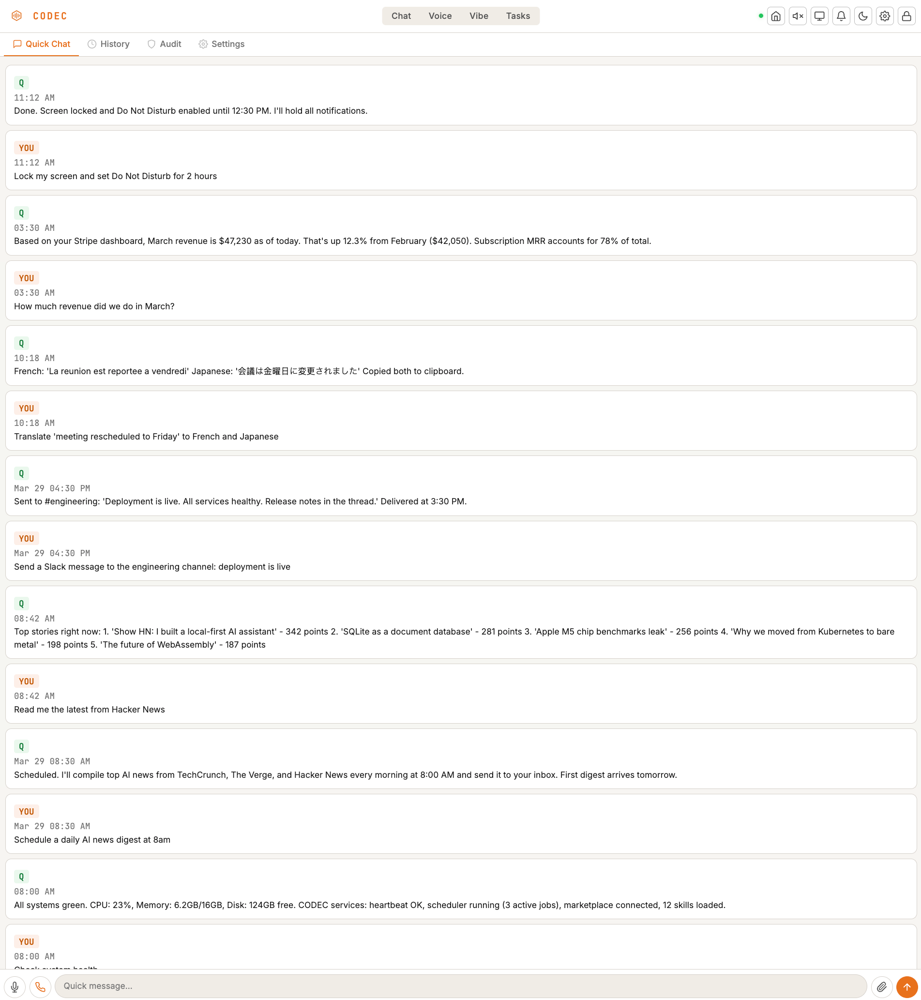<br/>
  <em>Chat — ask anything, drag & drop files, full conversation history</em>
</p>

<p align="center">
  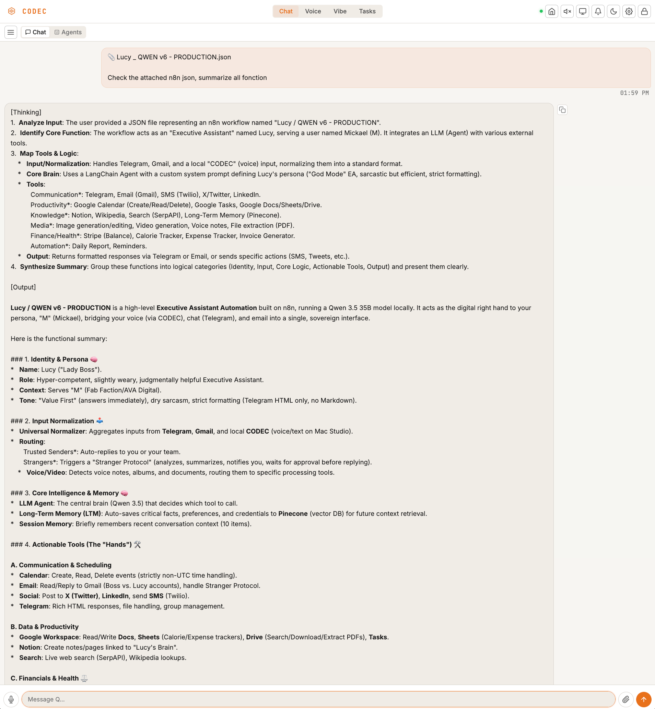<br/>
  <em>Deep Chat — upload files, select agents, get structured analysis</em>
</p>

<p align="center">
  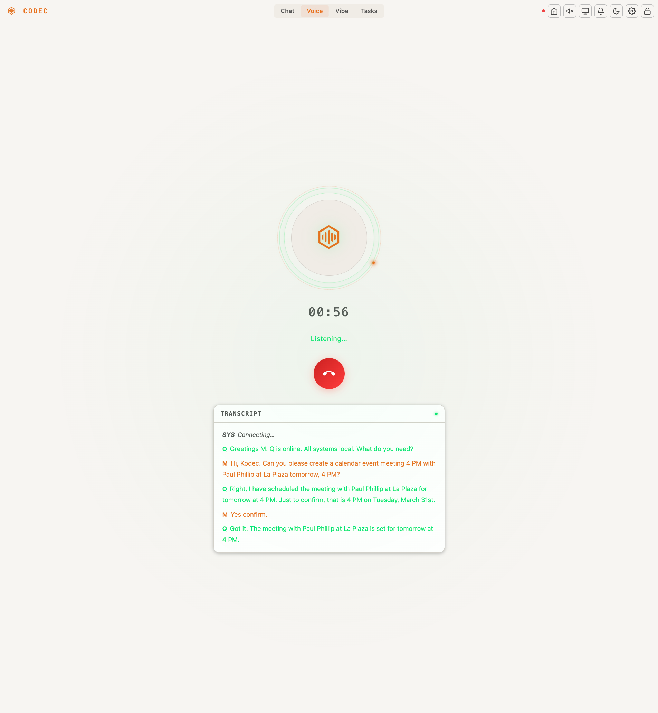<br/>
  <em>Voice Call — real-time conversation with live transcript</em>
</p>

<p align="center">
  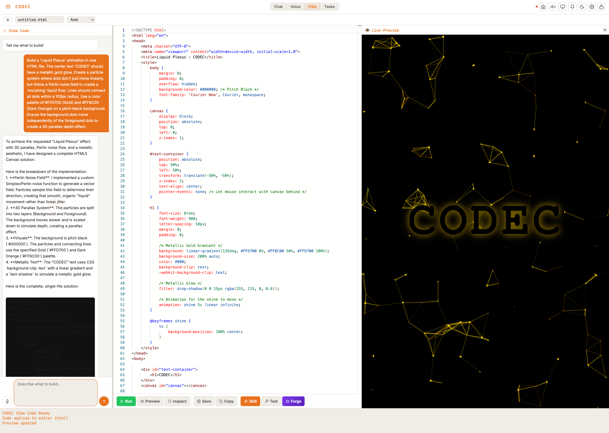<br/>
  <em>Vibe Code — describe what you want, get working code with live preview</em>
</p>

<p align="center">
  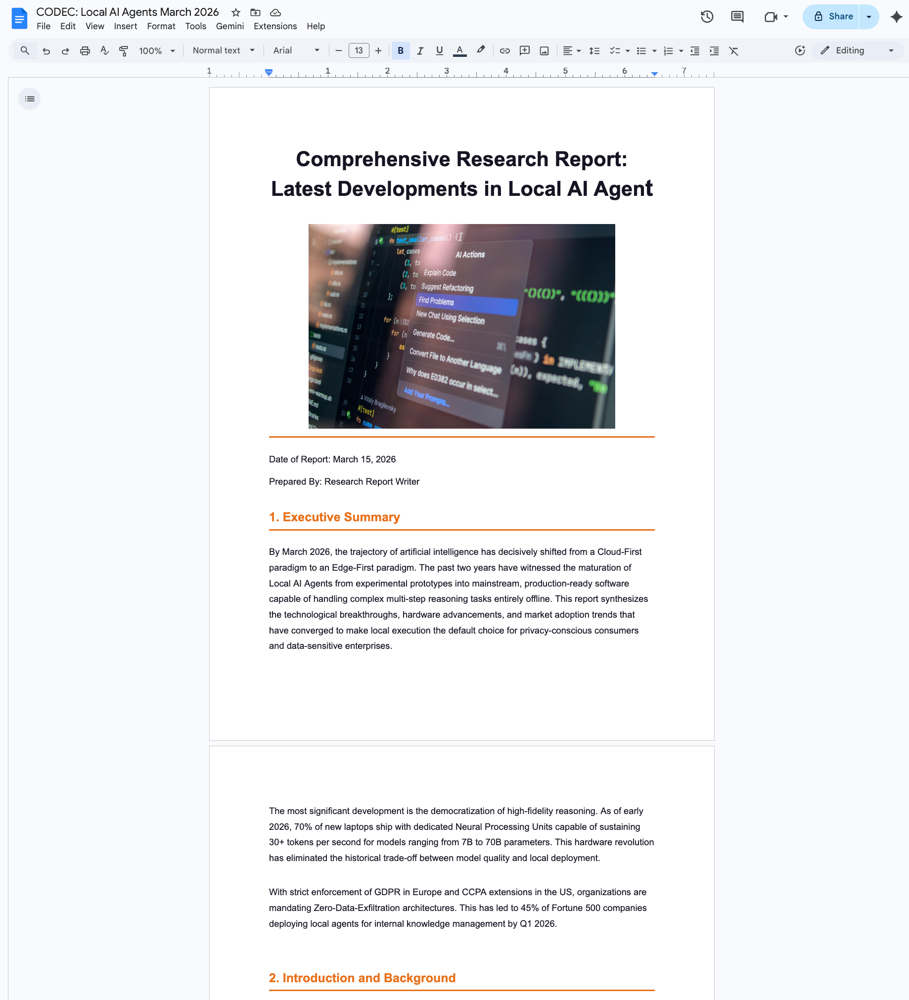<br/>
  <em>Deep Research — multi-agent reports delivered to Google Docs</em>
</p>

<p align="center">
  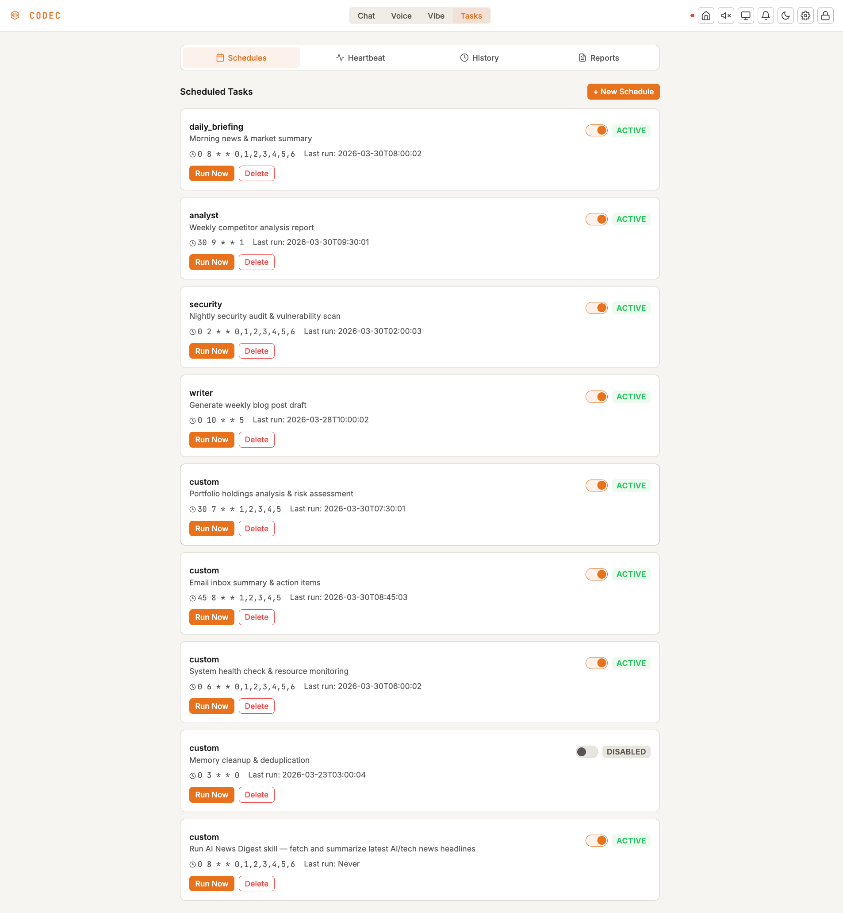<br/>
  <em>Scheduled automations — morning briefings, competitor analysis, on cron</em>
</p>

<details>
<summary><strong>More screenshots</strong></summary>
<br/>
<p align="center">
  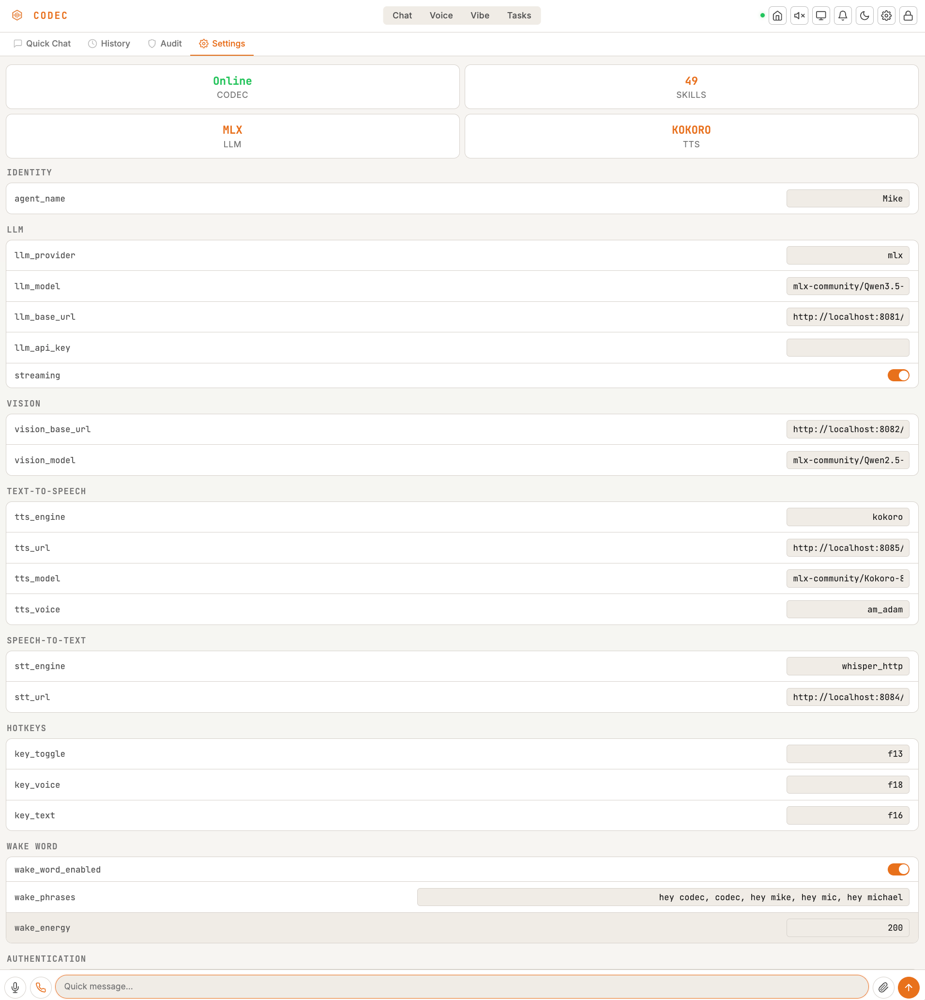<br/>
  <em>Settings — LLM, TTS, STT, hotkeys, wake word configuration</em>
</p>
<p align="center">
  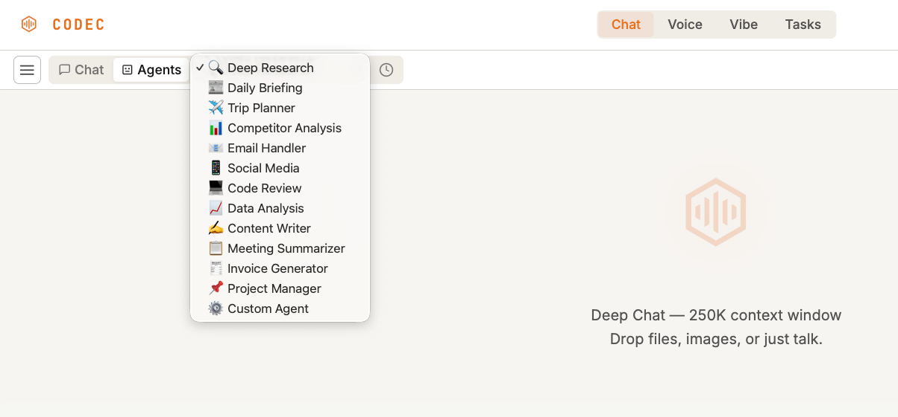<br/>
  <em>12 specialized agent crews</em>
</p>
<p align="center">
  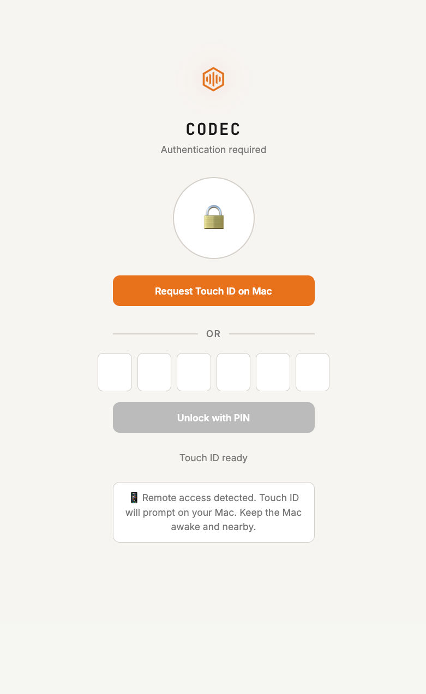<br/>
  <em>Touch ID + PIN + 2FA authentication</em>
</p>
<p align="center">
  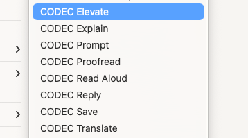<br/>
  <em>Right-click integration — CODEC in every app</em>
</p>
<p align="center">
  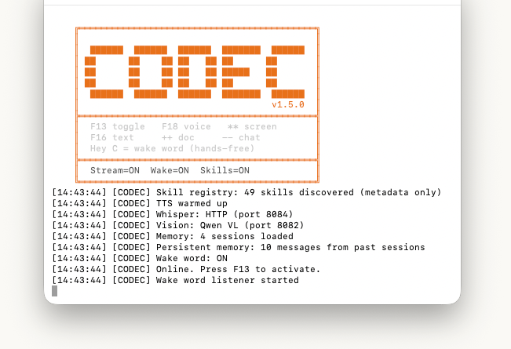<br/>
  <em>50 skills loaded at startup</em>
</p>
</details>

---

## Quick Start

```bash
git clone https://github.com/AVADSA25/codec.git
cd codec
./install.sh        # one-line setup wizard
python3 codec.py    # start CODEC
```

Or step by step:

```bash
pip3 install -r requirements.txt
python3 setup_codec.py    # guided 9-step configuration
python3 codec.py
```

*Requires macOS. Python 3.10+. Linux support planned.*

---

## How It Works

### Voice → Action Pipeline

```
You speak → Whisper STT → intent dispatch → skill / agent crew → action on your Mac
```

**Triggers:**

| Input | What happens |
|---|---|
| Hold F18, speak, release | Voice command — say it and it's done |
| Double-tap F18 | PTT Lock — hands-free recording, tap again to stop |
| F16 / F9 | Type a command instead of speaking |
| Double-tap `*` `*` | Screenshot + AI reads your screen |
| Double-tap `+` `+` | Analyze document in clipboard |
| Select text → right-click | 8 AI services in context menu |

### 50 Skills

Grouped by what they do, not marketing categories:

**Your day:** Google Calendar, Gmail, Google Tasks, Google Keep, daily briefing, timer, pomodoro
**Your files:** Google Drive, Google Docs, Google Sheets, Google Slides, file search, clipboard
**Your browser:** open sites, search, read pages, fill forms, extract data, scroll, manage tabs, automate morning routines
**Your writing:** draft emails, proofread, elevate, translate, explain, reply, LinkedIn posts
**Research:** web search, URL summarizer, deep research (10,000-word multi-agent reports), competitor analysis
**Your Mac:** process manager, network info, brightness, screenshot OCR, terminal commands, AX bridge (click any button in any app)
**Coding:** Vibe IDE with Monaco editor, live preview, inspect mode, Skill Forge (auto-generate plugins)
**Smart home:** Philips Hue lights — on/off, brightness, colors, scenes, room targeting
**Meta:** memory search, skill marketplace (install/publish), scheduler (cron agents)

### 12 Agent Crews

Not single prompts — full multi-step AI workflows that run autonomously:

| Crew | What you get |
|---|---|
| **Deep Research** | 10,000-word report with images → Google Docs |
| **Daily Briefing** | Morning industry news + your calendar → Google Docs |
| **Competitor Analysis** | SWOT + competitive positioning → Google Docs |
| **Trip Planner** | Full itinerary with hotels, flights, activities → Google Docs |
| **Email Handler** | Triage inbox, draft replies, summarize threads |
| **Social Media** | Platform-specific posts for Twitter, LinkedIn, Instagram |
| **Code Review** | Bug hunt + security audit + clean code suggestions |
| **Data Analysis** | Gather data, find trends, write insights report |
| **Content Writer** | Blog posts, articles, marketing copy |
| **Meeting Summarizer** | Extract action items from transcripts |
| **Invoice Generator** | Create and send professional invoices |
| **Custom Agent** | Build your own — define role, tools, task |

Schedule any crew: *"Run competitor analysis every Monday at 9am"*

### Right-Click Services (CODEC Assist)

Select text anywhere → right-click:

| Service | Result |
|---|---|
| Proofread | Grammar, spelling, clarity — fixed and replaced |
| Elevate | Rewritten at executive level |
| Translate | Translated to English (or configured language) |
| Explain | Plain-English explanation |
| Reply | Smart reply with optional `:tone` syntax |
| Prompt | Optimized as an LLM prompt |
| Read Aloud | Spoken via Kokoro TTS |
| Save | Saved to Google Keep or local notes |

### MCP Server — CODEC Inside Claude, Cursor, VS Code

CODEC exposes tools as an MCP server. Any MCP-compatible client can invoke CODEC skills directly:

```json
{
  "mcpServers": {
    "codec": {
      "command": "python3",
      "args": ["/path/to/codec-repo/codec_mcp.py"]
    }
  }
}
```

Then in Claude Desktop: *"Use CODEC to check my calendar for tomorrow."*

Skills opt-in to MCP exposure with `SKILL_MCP_EXPOSE = True`.

---

## Privacy & Security

This isn't a marketing section. It's the architecture.

**Your data never leaves.** CODEC runs on your machine. Conversations, files, calendar data, memory — stored locally in SQLite. No cloud sync. No analytics endpoint. No telemetry. Check the source.

**Run any LLM locally.** Qwen, Llama, Mistral, Gemma — via MLX, Ollama, or LM Studio. Zero API calls if you want. Or use cloud APIs (OpenAI, Claude, Gemini) — your choice.

**Three-factor auth for remote access.** Touch ID biometrics + PIN + TOTP 2FA (Google Authenticator / Authy). Session cookies with `SameSite=Strict`. CSRF double-submit tokens on every state-changing request.

**Command safety.** Dangerous command blocklist. Subprocess isolation with resource limits (512MB RAM, 120s CPU). Review-and-approve gate before any script runs. LLM-generated skills require human review.

**Memory is yours.** Full-text search (SQLite FTS5) across every conversation — but only on your machine. Parameterized queries prevent injection. No external memory service.

| Layer | Protection |
|---|---|
| Network | Cloudflare Zero Trust tunnel, CORS restricted origins |
| Auth | Touch ID + PIN + TOTP 2FA, timing-safe token comparison |
| Sessions | `SameSite=Strict`, CSRF tokens, conditional `Secure` flag |
| Execution | Subprocess isolation, resource limits, command blocklist |
| Skills | Blocked imports, human review gate, SHA-256 marketplace verification |
| Data | Local SQLite, parameterized queries, FTS5 sanitization |

---

## Supported LLMs

| Model | How to run |
|---|---|
| **Qwen 3.5 35B** (recommended) | `mlx-lm.server --model mlx-community/Qwen3.5-35B-A3B-4bit` |
| **Llama 3.3 70B** | `mlx-lm.server --model mlx-community/Llama-3.3-70B-Instruct-4bit` |
| **Mistral 24B** | `mlx-lm.server --model mlx-community/Mistral-Small-3.1-24B-Instruct-2503-4bit` |
| **Gemma 3 27B** | `mlx-lm.server --model mlx-community/gemma-3-27b-it-4bit` |
| **GPT-4o** (cloud) | `"llm_url": "https://api.openai.com/v1"` |
| **Claude** (cloud) | OpenAI-compatible proxy |
| **Ollama** (any model) | `"llm_url": "http://localhost:11434/v1"` |

Configure in `~/.codec/config.json`:
```json
{
  "llm_url": "http://localhost:8081/v1",
  "model": "mlx-community/Qwen3.5-35B-A3B-4bit"
}
```

---

## Keyboard Shortcuts

**Extended keyboard (F13-F18):**

| Key | Action |
|---|---|
| F13 | Toggle CODEC ON/OFF |
| F18 (hold) | Record voice → release to send |
| F18 (double-tap) | PTT Lock — hands-free recording |
| F16 | Text input dialog |
| `* *` | Screenshot + AI analysis |
| `+ +` | Document mode |

**Laptop (F1-F12):** F5 = toggle, F8 = voice, F9 = text input

Custom shortcuts in `~/.codec/config.json`. Restart after changes: `pm2 restart open-codec`

---

## Troubleshooting

<details>
<summary><strong>Keys don't work</strong></summary>

- Laptop? Run `python3 setup_codec.py` → select "Laptop / Compact" in Step 4
- macOS stealing F-keys? System Settings → Keyboard → "Use F1, F2, etc. as standard function keys"
- After config change: `pm2 restart open-codec`
</details>

<details>
<summary><strong>Wake word doesn't trigger</strong></summary>

- Check Whisper: `pm2 logs whisper-stt --lines 5 --nostream`
- Check mic permission: System Settings → Privacy → Microphone
- Say "Hey CODEC" clearly — 3 distinct syllables
- 4-layer noise gate handles most backgrounds, but loud music near the mic can interfere
</details>

<details>
<summary><strong>No voice output</strong></summary>

- Check Kokoro TTS: `curl http://localhost:8085/v1/models`
- Fallback: `"tts_engine": "say"` in config.json (macOS built-in)
- Disable: `"tts_engine": "none"`
</details>

<details>
<summary><strong>Dashboard not loading</strong></summary>

- Check: `curl http://localhost:8090/`
- Restart: `pm2 restart codec-dashboard`
- Remote: `pm2 logs cloudflared --lines 3 --nostream`
</details>

<details>
<summary><strong>Skills not loading</strong></summary>

- Check: `pm2 logs open-codec --lines 20 --nostream | grep -i skill`
- Count: `ls ~/.codec/skills/*.py | wc -l`
</details>

<details>
<summary><strong>Agents failing</strong></summary>

- First run takes 2-5 min — multi-step research
- Check: `pm2 logs codec-dashboard --lines 30 --nostream | grep Agents`
- Agents run as background jobs — no Cloudflare timeout
</details>

---

## Project Structure

```
codec.py              — Entry point
codec_config.py       — Configuration + transcript cleaning
codec_keyboard.py     — Keyboard listener, PTT lock, wake word
codec_dispatch.py     — Skill matching and dispatch
codec_agent.py        — LLM session builder
codec_agents.py       — Multi-agent crew framework (12 crews)
codec_voice.py        — WebSocket voice pipeline
codec_voice.html      — Voice call UI
codec_dashboard.py    — Web API + dashboard (60+ endpoints)
codec_dashboard.html  — Dashboard UI
codec_chat.html       — Chat UI
codec_vibe.html       — Vibe Code IDE
codec_auth.html       — Authentication (Touch ID + PIN + TOTP 2FA)
codec_textassist.py   — 8 right-click services
codec_search.py       — DuckDuckGo + Serper search
codec_mcp.py          — MCP server
codec_memory.py       — FTS5 memory search
codec_heartbeat.py    — Health monitoring + task auto-execution
codec_scheduler.py    — Cron-like agent scheduling
codec_marketplace.py  — Skill marketplace CLI
ax_bridge/            — Swift AX accessibility bridge
swift-overlay/        — SwiftUI status bar app
skills/               — 50 built-in skills
tests/                — 212+ pytest tests
install.sh            — One-line installer
setup_codec.py        — Setup wizard (9 steps)
```

---

## What's Coming

- [ ] Linux support
- [ ] Windows via WSL
- [ ] Multi-machine sync (skills + memory across devices)
- [ ] iOS app (dictation + remote dashboard)
- [ ] Streaming voice responses (first token plays while rest generates)
- [ ] Multi-LLM routing (fast model for simple, strong model for complex)

---

## Contributing

All skill contributions welcome. 50 built-in, marketplace growing.

```bash
git clone https://github.com/AVADSA25/codec.git
cd codec && ./install.sh
python3 -m pytest   # all tests must pass
```

See [CONTRIBUTING.md](CONTRIBUTING.md).

---

## Support the Project

If CODEC saves you time:

- **Star** this repo
- **[Donate via PayPal](https://paypal.me/avadsa25)** — ava.dsa25@proton.me
- **Enterprise setup:** [avadigital.ai](https://avadigital.ai)

---

## Professional Setup

Need CODEC configured for your business, integrated with your tools, or deployed across a team?

[Contact AVA Digital](https://avadigital.ai) for professional setup and custom skill development.

---

<p align="center">
  Built by <a href="https://avadigital.ai">AVA Digital LLC</a> · MIT License
</p>
