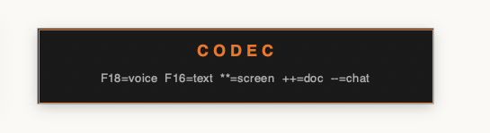

<p align="center">
  
</p>

<h1 align="center">CODEC</h1>
<p align="center"><strong>Open Source Computer Command Framework — v1.5.0</strong></p>
<p align="center">
  Voice-controlled, local-first AI agent that runs on your machine with any LLM.<br/>
  No cloud. No subscription. No data leaves your computer.
</p>
<p align="center">
  <a href="https://opencodec.org">opencodec.org</a> · <a href="https://avadigital.ai">AVA Digital LLC</a>
</p>
<p align="center">
  <a href="#support-the-project">☕ Support the Project</a> · <a href="#professional-setup">🏢 Enterprise Setup</a>
</p>

---

## What is CODEC?

CODEC turns your computer into a voice-controlled AI workstation. Press a key or say *"Hey CODEC"* — CODEC listens, thinks (using any LLM you choose), and acts: opening apps, drafting messages, reading your screen, analyzing documents, researching topics, writing code, and anything else you can describe.

A private, open-source alternative to Siri and Alexa that actually controls your computer — and writes its own plugins.

*Built for macOS.* Linux support planned.

---

## Screenshots

<p align="center">
  <br/>
  <em>Quick Chat — ask anything, drag & drop files, full conversation history</em>
</p>

<p align="center">
  <br/>
  <em>Deep Chat — upload files, select agents, get structured analysis</em>
</p>

<p align="center">
  <br/>
  <em>Voice Call — real-time voice conversation with live transcript</em>
</p>

<p align="center">
  <br/>
  <em>Vibe Code — describe what you want, get working code with live preview</em>
</p>

<p align="center">
  <br/>
  <em>Deep Research — multi-agent reports delivered to Google Docs</em>
</p>

<p align="center">
  <br/>
  <em>Tasks — scheduled automations, cron jobs, background reports</em>
</p>

<p align="center">
  <br/>
  <em>Settings — configure LLM, TTS, STT, hotkeys, wake word, and more</em>
</p>

<p align="center">
  <br/>
  <em>12 specialized agents — Deep Research, Code Review, Content Writer, and more</em>
</p>

<p align="center">
  <br/>
  <em>Touch ID + PIN authentication — secure remote access</em>
</p>

<details>
<summary><strong>Hotkey Overlays & Terminal</strong></summary>
<br/>
<p align="center">
  <br/>
  <em>F13 — Toggle CODEC on/off</em>
</p>
<p align="center">
  <br/>
  <em>F18 — Hold to record voice command</em>
</p>
<p align="center">
  <br/>
  <em>Transcribing — Whisper processes your speech</em>
</p>
<p align="center">
  <br/>
  <em>Right-click integration — CODEC in every app</em>
</p>
<p align="center">
  <br/>
  <em>Terminal — CODEC startup with 49 skills loaded</em>
</p>
</details>

---

## Power Examples

```
"Hey CODEC, draft a reply to my last email saying I'll call tomorrow afternoon"
→ Reads Gmail, writes a professional reply, copies to clipboard

"CODEC, deep research artificial intelligence in healthcare — save to Google Docs"
→ Runs 8 AI agents, 20+ web searches, writes 10,000-word report with images to Drive

"Hey CODEC, open my competitor's website and write a 5-page analysis"
→ Reads the site via Chrome CDP, runs competitor analysis crew, saves to Google Docs

"CODEC, schedule my daily briefing every morning at 8"
→ Creates a cron schedule — every morning at 8am CODEC researches your industry and delivers a report

"Hey CODEC, what was I working on yesterday?"
→ Searches 1,800+ memory entries with FTS5, summarises your last 5 sessions

"CODEC, click the Submit button in Xcode"
→ ax_bridge reads the AX tree of Xcode, finds the button, clicks it
```

---

## Quick Commands

```
Hey CODEC, summarise this article [paste URL]
Hey CODEC, open Safari and search for Mac Studio reviews
Hey CODEC, write a LinkedIn post about my new project
Hey CODEC, what's on my calendar today?
Hey CODEC, install the bitcoin-price skill
Hey CODEC, run competitor analysis on OpenAI
```

---

## Quick Start

```bash
git clone https://github.com/AVADSA25/codec.git
cd codec
./install.sh        # one-line setup wizard
python3 codec.py    # start CODEC
```

Or with Python directly:

```bash
pip3 install -r requirements.txt
python3 setup_codec.py    # guided configuration
python3 codec.py
```

---

## 7 Product Frames

### 🎙️ CODEC Core — Voice Command Center

The heart of CODEC. Press a key, speak, release — your command executes.

| Trigger | Action |
|---------|--------|
| Hold F18 (or F8 on laptop) | Record voice command |
| F16 / F9 | Type command in dialog |
| F13 / F5 | Toggle CODEC ON/OFF |
| `*` `*` (double tap) | Screenshot + describe screen |
| `+` `+` (double tap) | Read document in clipboard |
| Say "Hey CODEC…" | Always-on wake word |

**PTT Lock Mode:** Double-tap F18 within 0.5s to lock recording hands-free. Tap again to stop.

**Voice Session Warmup:** CODEC pre-loads your memory the moment it detects you speaking — 500ms faster responses.

---

### ✍️ CODEC Dictate — Speak Anywhere

Hold any key, speak, release — text appears in any app.

- Whisper STT transcription (local, private)
- Smart post-processing: removes stutters, fixes "KODAK" → CODEC, strips hallucinations
- Works in any text field: Xcode, Word, Slack, browser, terminal

---

### 🖱️ CODEC Assist — 8 Right-Click Services

Select any text, right-click → CODEC transforms it instantly.

| Service | What it does |
|---------|-------------|
| **CODEC Proofread** | Fix grammar, spelling, clarity |
| **CODEC Elevate** | Rewrite at executive level |
| **CODEC Explain** | Plain-English explanation |
| **CODEC Translate** | Translate to English |
| **CODEC Prompt** | Optimise text as an LLM prompt |
| **CODEC Reply** | Draft a reply (supports `:tone` syntax) |
| **CODEC Read Aloud** | Speak selected text via Kokoro TTS |
| **CODEC Save** | Save to Google Keep or local notes |

Install: `System Settings → Privacy → Accessibility → Services`

---

### 💬 CODEC Chat — Deep Chat + Multi-Agent

A 250K-context AI chat with file uploads, vision, web search, and multi-agent crews.

**Features:**
- 250K token context window
- File upload: PDF, code, images (vision)
- Force web search toggle (🔍 Web button)
- 8 built-in Agent Crews (see below)
- Custom agent builder — define role, tools, task
- Agent scheduling: run crews automatically on a cron schedule

**8 Agent Crews:**

| Crew | What it does |
|------|-------------|
| `deep_research` | Full research report → Google Docs (10,000 words, images) |
| `daily_briefing` | Morning news + industry summary → Google Docs |
| `trip_planner` | Itinerary, hotels, flights → Google Docs |
| `competitor_analysis` | SWOT + competitive positioning → Google Docs |
| `email_handler` | Triage, draft replies, summarise inbox |
| `social_media` | Platform-specific posts (Twitter, LinkedIn, Instagram) |
| `code_review` | Bug hunt + security audit + clean code suggestions |
| `data_analysis` | Gather data, find trends, write insights report |

**Scheduled Agents:**
```
"Hey CODEC, run daily briefing every morning at 8"
"Schedule competitor analysis every Monday"
"List schedules"
```

---

### 🖥️ CODEC Vibe — AI Coding IDE

Monaco editor + AI chat + live preview + Skill Forge, all in your browser.

**Features:**
- Monaco editor (VS Code engine)
- AI chat panel with full context
- ▶ Run code in-browser
- 👁️ Live Preview with point-click Inspect Mode
  - Click any element in the preview → jumps to that line in Monaco
  - Inline Edit Panel: change text, color, font size, padding visually
  - Apply + Sync to Editor — changes write back to Monaco code permanently
- ⚡ Skill Forge — paste code, GitHub URL, or describe in plain English → auto-converts to CODEC skill
- 💾 Save as Skill — save anything in the editor directly to `~/.codec/skills/`

---

### 📞 CODEC Voice — WebSocket Voice Calls

A WebRTC-style voice interface built from scratch. No third-party voice pipeline.

**Features:**
- Real-time voice activity detection (VAD)
- Wake-word detection with 4-layer noise gate:
  - Smoothed energy threshold (decay rate 0.85)
  - Speech fraction gate (≥12% samples above threshold)
  - Whisper confidence filter (avg_logprob ≥ -1.0)
  - Noise floor 30.0
- Voice energy ring animation (mic RMS → animated glow)
- Full conversation memory across calls
- Skill dispatch mid-call
- Native SwiftUI status bar overlay (replaces tkinter popups)

---

### 📱 CODEC Remote — Phone Dashboard PWA

Control your Mac from anywhere via a mobile-optimised web dashboard.

- Real-time status: all services, memory stats, last command
- Send commands from phone
- View conversation history
- Secured via Cloudflare Zero Trust tunnel
- Works on any device with a browser

**Setup:**
```bash
cloudflared tunnel --url http://localhost:8090
```

Access at: `https://codec.yourdomain.com`

---

## Advanced Features

### 🔌 MCP Server — CODEC Tools for Claude Desktop & Cursor

CODEC exposes 43 tools as an MCP server. Claude Desktop, Cursor, VS Code Copilot, and any MCP client can invoke CODEC skills directly.

```json
// ~/.claude/claude_desktop_config.json
{
  "mcpServers": {
    "codec": {
      "command": "python3",
      "args": ["/Users/you/codec-repo/codec_mcp.py"]
    }
  }
}
```

Then in Claude: *"Use the CODEC google_calendar skill to check my schedule for tomorrow."*

**Exposing Skills via MCP**

By default, skills are **not** exposed to MCP clients (opt-in model). To expose a skill, add `SKILL_MCP_EXPOSE = True` to its header:

```python
# ~/.codec/skills/my_skill.py
SKILL_TRIGGERS = ["do my thing"]
SKILL_DESCRIPTION = "Does the thing"
SKILL_MCP_EXPOSE = True  # makes this skill available to MCP clients

def run(text: str) -> str:
    return "Done."
```

**Global MCP config** (`~/.codec/config.json`):

| Option | Default | Description |
|--------|---------|-------------|
| `mcp_default_allow` | `false` | If `true`, all skills are exposed unless excluded. If `false` (default), only skills with `SKILL_MCP_EXPOSE = True` are exposed. |
| `mcp_allowed_tools` | `[]` | Explicit allowlist of skill names. Overrides per-skill flags when non-empty. |

---

### 📦 Skill Marketplace

Browse, install, and publish skills from the community registry.

```bash
codec install bitcoin-price        # Install from marketplace
codec search weather               # Search available skills
codec list                         # All installed skills
codec update                       # Update marketplace skills
codec publish my-skill.py          # Submit your skill
```

Or by voice: *"Hey CODEC, install the bitcoin price skill"*

---

### ⏰ Scheduled Agents (Cron-like)

Schedule any agent crew to run automatically.

```bash
# Via voice
"Run daily briefing every morning at 8"
"Schedule competitor analysis every Monday at 9am"
"List schedules"

# Via CLI
python3 codec_scheduler.py add daily_briefing --hour 8
python3 codec_scheduler.py list
```

Powered by `codec-scheduler` PM2 process — checks every minute, fires crews on schedule.

---

### 💓 Heartbeat — Auto-Monitoring + Task Execution

`codec-heartbeat` runs every 30 minutes:
- ✅ Checks all 5 AI services are alive
- 📊 Reports memory stats (entries, sessions)
- 🔍 Finds tasks saved during voice calls
- 🚀 **Auto-executes** pending tasks via `/api/command`

Example: Say *"Save a task for CODEC to open YouTube and search for AI news"* during a voice call. Next heartbeat picks it up and executes it automatically.

---

### 🔧 AX Bridge — Native App Control

A compiled Swift binary giving CODEC full accessibility control over any macOS app.

```bash
# Click a button by name
./ax_bridge --pid <pid> --action click --selector "role:AXButton name:OK"

# Read a text field
./ax_bridge --pid <pid> --action value --selector "role:AXTextField"

# Show full UI tree
./ax_bridge --pid <pid> --action tree --depth 2
```

Voice: *"Hey CODEC, click the Submit button"* → clicks in the frontmost app

---

### 🌐 Chrome CDP — Deep Browser Automation

Chrome DevTools Protocol integration for precise browser control.

```
Fill form fields by CSS selector
Click specific elements
Extract structured data (tables, prices, links)
Take page screenshots
Run JavaScript in any tab
```

Falls back to AppleScript if Chrome CDP is unavailable.

---

### 🧠 FTS5 Memory Search

Full-text search across every conversation CODEC has ever had.

```
"Hey CODEC, what did I ask about React hooks last week?"
"Search my memory for anything about the Berlin trip"
```

SQLite FTS5 index — instant results across thousands of entries.

---

## Skills

CODEC ships with 48 built-in skills. Add more via the Marketplace or write your own.

**Google Workspace**

| Skill | Triggers |
|-------|---------|
| `google_calendar` | "what's on my calendar", "schedule meeting", "add event" |
| `gmail_reader` | "read my emails", "check Gmail", "latest emails" |
| `google_drive` | "search my Drive", "find file", "list Drive files" |
| `google_docs_create` | "create a doc", "write to Google Docs" |
| `google_sheets` | "open spreadsheet", "create sheet" |
| `google_slides` | "create presentation", "make slides" |
| `google_tasks` | "add to tasks", "check my tasks" |
| `google_keep` | "save note", "add to Keep" |

**Productivity**

| Skill | Triggers |
|-------|---------|
| `calculator` | "calculate", "what is", "how much is" |
| `clipboard` | "paste that", "copy to clipboard" |
| `timer` | "set timer", "remind me in" |
| `pomodoro` | "pomodoro", "focus timer" |
| `file_search` | "find file", "where is", "search files" |
| `memory_search` | "what did I ask about", "search my memory" |
| `scheduler` | "schedule agent", "run every morning" |
| `marketplace` | "install skill", "search skills" |

**System**

| Skill | Triggers |
|-------|---------|
| `process_manager` | "what's using CPU", "kill process" |
| `network_info` | "what's my IP", "check network" |
| `brightness` | "dim screen", "brightness up" |
| `screenshot_ocr` | "read what's on screen", "OCR this" |
| `terminal_run` | "run command", "execute in terminal" |

**Chrome (AppleScript + CDP)**

| Skill | Triggers |
|-------|---------|
| `chrome_open` | "open Chrome", "open website" |
| `chrome_search` | "search for", "Google" |
| `chrome_read` | "read this page", "what does this page say" |
| `chrome_tabs` | "list tabs", "close tab", "switch tab" |
| `chrome_fill` | "fill in", "fill form" |
| `chrome_extract` | "extract from page", "get data from page" |
| `chrome_scroll` | "scroll down", "scroll to bottom" |
| `chrome_automate` | "morning tabs", "open work tabs" |

**Research & Writing**

| Skill | Triggers |
|-------|---------|
| `web_search` | "search the web", "look up" |
| `web_fetch` | "summarise this article", "fetch URL" |
| `draft_email` | "draft email", "write email to" |
| `proofread` | "proofread this", "fix my writing" |

---

## Security

CODEC runs entirely on your machine. Nothing is sent to any external server unless you configure it.

### Authentication
- **Biometric auth:** Touch ID and PIN-based authentication for the dashboard.
- **API token auth:** All API endpoints require a bearer token. Token comparison uses timing-safe `hmac.compare_digest` to prevent timing attacks.

### Session Management
- Cookie-based sessions with `SameSite=Strict`. The `Secure` flag is set conditionally (enabled when served over HTTPS).

### Command Execution
- **Subprocess isolation:** All skill scripts run as subprocesses with resource limits (512MB RAM, 120s CPU).
- **Dangerous command blocklist:** Configurable patterns block destructive commands (`rm -rf /`, `mkfs`, `dd`, etc.) before execution.
- **Command Preview:** Review and Approve/Deny before any script runs.

### Skill Forge
- LLM-generated skills go through a human review gate before activation.
- Blocked imports validation prevents skills from importing dangerous modules.

### MCP
- Default opt-in mode for tool exposure: tools are not exposed to MCP clients unless explicitly enabled.

### Memory
- FTS5 search queries are sanitized to strip special characters before execution.
- All database queries use parameterized statements to prevent SQL injection.

### Marketplace
- Downloaded skills are verified with SHA-256 checksum comparison before installation.
- Unverified or modified skills show warnings and require explicit confirmation.

### CORS
- Restricted allowed origins and methods on all API endpoints.

### Google OAuth
- Read+write scopes, token stored in `~/.codec/google_token.json`.

---

## Keyboard Shortcuts

### Extended Keyboard (F13-F18)

| Key | Action |
|-----|--------|
| F13 | Toggle CODEC ON/OFF |
| F18 (hold) | Record voice, release to send |
| F18 (double-tap) | PTT Lock — hands-free dictation |
| F16 | Text input dialog |
| `* *` | Screenshot mode |
| `+ +` | Document mode |

### Laptop / Compact Keyboard (F1-F12)

| Key | Action |
|-----|--------|
| F5 | Toggle CODEC ON/OFF |
| F8 (hold) | Record voice, release to send |
| F9 | Text input dialog |

**For laptop mode:** Enable "Use F1, F2, etc. as standard function keys" in System Settings → Keyboard.

**Custom shortcuts:** Edit `~/.codec/config.json`:
```json
{
  "key_toggle": "f5",
  "key_voice": "f8",
  "key_text": "f9"
}
```
Then restart: `pm2 restart open-codec`

---

## Supported LLMs

CODEC works with any OpenAI-compatible local or cloud API:

| LLM | Setup |
|-----|-------|
| **Qwen 3.5 35B** (recommended) | `mlx-lm.server --model mlx-community/Qwen3.5-35B-A3B-4bit` |
| **Llama 3.3 70B** | `mlx-lm.server --model mlx-community/Llama-3.3-70B-Instruct-4bit` |
| **Mistral 24B** | `mlx-lm.server --model mlx-community/Mistral-Small-3.1-24B-Instruct-2503-4bit` |
| **Gemma 3 27B** | `mlx-lm.server --model mlx-community/gemma-3-27b-it-4bit` |
| **GPT-4o** (cloud) | `"llm_url": "https://api.openai.com/v1"` |
| **Claude API** (cloud) | Use OpenAI-compatible proxy |
| **Ollama** | `"llm_url": "http://localhost:11434/v1"` |

Change in `~/.codec/config.json`:
```json
{
  "llm_url": "http://localhost:8081/v1",
  "model": "mlx-community/Qwen3.5-35B-A3B-4bit"
}
```

---

## Troubleshooting

### Keys don't work
- **Laptop keyboard?** Run `python3 setup_codec.py` → select "Laptop / Compact" in Step 4
- **macOS stealing F-keys?** System Settings → Keyboard → enable "Use F1, F2, etc. as standard function keys"
- **Specific conflict?** System Settings → Keyboard → Keyboard Shortcuts → Mission Control → uncheck conflicting key
- **After config change:** Always restart: `pm2 restart open-codec`

### Wake word doesn't trigger
- Check Whisper: `pm2 logs whisper-stt --lines 5 --nostream`
- Check mic permission: System Settings → Privacy & Security → Microphone
- Speak clearly: "Hey CODEC" — 3 distinct syllables
- Background noise? The 4-layer noise gate filters most noise, but loud music near the mic can interfere

### No voice output
- Check Kokoro: `curl http://localhost:8085/v1/models`
- Fallback to macOS `say`: set `"tts_engine": "say"` in config.json
- Disable TTS: set `"tts_engine": "none"`

### Dashboard not loading
- Check: `curl http://localhost:8090/`
- Restart: `pm2 restart codec-dashboard`
- Remote access: `pm2 logs cloudflared --lines 3 --nostream`

### Skills not loading
- Check: `pm2 logs open-codec --lines 20 --nostream | grep -i skill`
- Count: `ls ~/.codec/skills/*.py | wc -l`
- Test: `python3 -c "from calculator import run; print(run('2+2'))"`

### Deep Research / Agents failing
- The first run takes 2-5 min — wait for it
- Check: `pm2 logs codec-dashboard --lines 30 --nostream | grep Agents`
- Verify Serper API key in `deep_research.py`
- Agents use background jobs — no Cloudflare timeout

---

## Project Structure

```
codec.py              — Entry point
codec_config.py       — Configuration and clean_transcript()
codec_keyboard.py     — Keyboard listener, PTT lock, wake word
codec_dispatch.py     — Skill matching and dispatch
codec_agent.py        — LLM session builder
codec_overlays.py     — Overlay popups
codec_compaction.py   — Context compaction
codec_memory.py       — FTS5 memory search
codec_agents.py       — Multi-agent crew framework (8 crews)
codec_voice.py        — WebSocket voice pipeline
codec_voice.html      — Voice call UI
codec_dashboard.py    — Web API + dashboard
codec_dashboard.html  — Dashboard page
codec_chat.html       — Deep Chat UI
codec_vibe.html       — Vibe Code IDE
codec_textassist.py   — 8 right-click services
codec_search.py       — DuckDuckGo + Serper search
codec_mcp.py          — MCP server (43 tools)
codec_heartbeat.py    — Health monitoring + task auto-execution
codec_scheduler.py    — Cron-like agent scheduling
codec_marketplace.py  — Skill Marketplace CLI
deep_research.py      — Deep Research crew (10k-word reports + images)
ax_bridge/            — Swift AX accessibility bridge
swift-overlay/        — SwiftUI status bar app
skills/               — 48 built-in skills
tests/                — 212+ pytest tests
install.sh            — One-line installer
setup_codec.py        — Setup wizard (9 steps)
```

---

## What's Coming

- [ ] Linux support (keyboard daemon, TTS, Whisper all work — packaging needed)
- [ ] Windows support via WSL
- [ ] Multi-machine sync (skills, memory across devices)
- [ ] CODEC iOS app (dictation + remote dashboard)
- [ ] Plugin API (third-party skill packages)
- [ ] Web UI skill editor (visual trigger + code editor)
- [ ] Streaming voice responses (first token plays while rest generates)
- [ ] Multi-LLM routing (fast model for simple, powerful for complex)

---

## Contributing

See [CONTRIBUTING.md](CONTRIBUTING.md). All skill submissions welcome — 48 built-in, marketplace growing.

```bash
git clone https://github.com/AVADSA25/codec.git
cd codec && ./install.sh
python3 -m pytest   # all tests must pass
```

---

## Support the Project

If CODEC saves you time, consider supporting development:

- ⭐ Star on GitHub
- ☕ [Buy me a coffee](https://buymeacoffee.com/avadsa)
- 🏢 **Enterprise / Professional Setup:** [avadigital.ai](https://avadigital.ai)

---

## Professional Setup

Need CODEC configured for your business, integrated with your tools, or deployed across a team? [Contact AVA Digital](https://avadigital.ai) for professional setup and custom skill development.

---

<p align="center">
  Built with ❤️ by <a href="https://avadigital.ai">AVA Digital LLC</a> · MIT License
</p>
