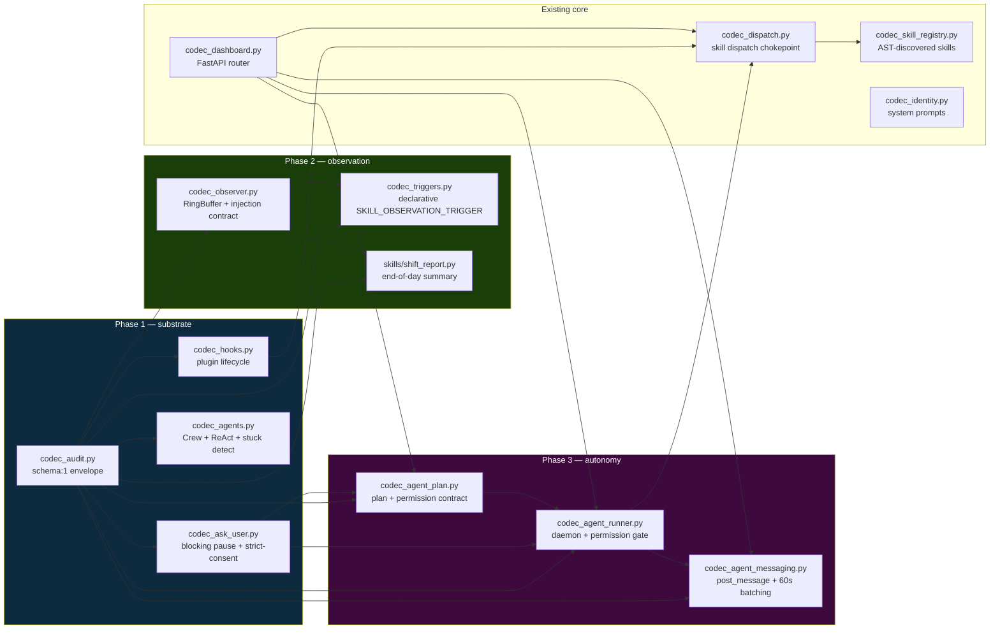
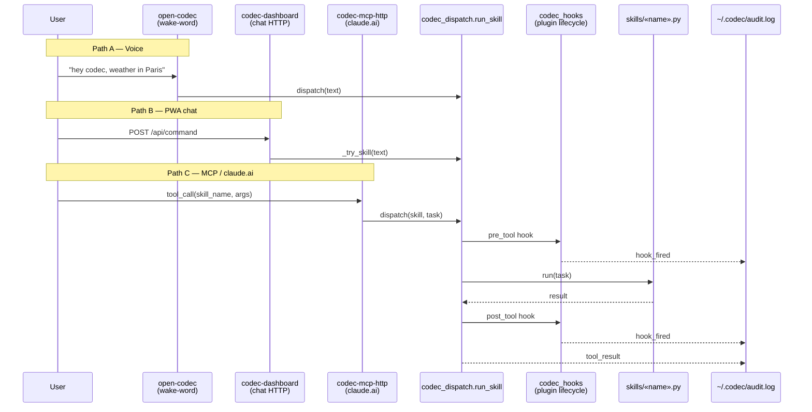
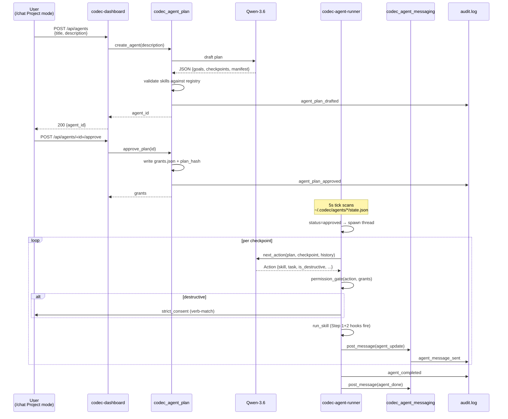

# CODEC Architecture

**Sovereign AI Workstation** runs as a swarm of small Python processes coordinated by PM2. No single monolith — each service has one clear responsibility, communicates through atomic file writes (`~/.codec/*.json`) or HTTP localhost calls, and can be killed without breaking the others.

This doc is for engineers who want to understand the runtime topology before reading the code. For per-feature design rationale, see `docs/PHASE*-*.md`.

---

## Process topology (PM2 services)

```mermaid
graph TB
    subgraph User["User-facing surfaces"]
        PWA[PWA / Browser<br/>localhost:8090]
        Voice[Wake-word / Voice<br/>open-codec]
        Hotkey[Global hotkeys<br/>codec-hotkey]
        Dictate[Dictation<br/>codec-dictate]
        iMessage[iMessage<br/>codec-imessage]
        Telegram[Telegram<br/>codec-telegram]
    end

    subgraph Core["Core services"]
        Dashboard[codec-dashboard<br/>FastAPI · port 8090<br/>chat / audit / settings UI]
        MCP[codec-mcp-http<br/>port 8091<br/>OAuth 2.1 · claude.ai bridge]
        Heartbeat[codec-heartbeat<br/>20-min daemon<br/>service health probes]
        Watchdog[codec-watchdog<br/>PM2 supervisor]
    end

    subgraph Phase2["Phase 2 — observation + automation"]
        Observer[codec-observer<br/>5s tick · RingBuffer<br/>active window + clipboard]
    end

    subgraph Phase3["Phase 3 — autonomous agents"]
        AgentRunner[codec-agent-runner<br/>5s tick · MAX_CONCURRENT=3<br/>Qwen ↔ skill loops]
    end

    subgraph LLMs["Local LLM services"]
        Qwen[qwen3.6<br/>OpenAI-compatible · port 8090]
        Whisper[whisper-stt<br/>STT]
        Kokoro[kokoro-82m<br/>TTS]
    end

    subgraph Storage["State (atomic R/W via tmp+rename)"]
        AuditLog[~/.codec/audit.log<br/>schema:1 · 30-day rotation]
        Memory[~/.codec/memory.db<br/>SQLite · 250K context]
        Notifications[~/.codec/notifications.json]
        Agents[~/.codec/agents/«id»/<br/>plan · grants · state · messages]
        Config[~/.codec/config.json]
        Skills[~/.codec/skills/«name».py<br/>user skills]
        Plugins[~/.codec/plugins/«name».py<br/>lifecycle hooks]
    end

    PWA --> Dashboard
    Voice --> Dashboard
    Hotkey --> Dashboard
    Dictate --> Dashboard
    iMessage --> Dashboard
    Telegram --> Dashboard

    Dashboard --> Qwen
    Dashboard --> Whisper
    Dashboard --> Kokoro
    Dashboard --> AuditLog
    Dashboard --> Memory
    Dashboard --> Notifications
    Dashboard --> Agents
    Dashboard --> Config

    MCP --> Dashboard

    Heartbeat -. probes .-> Qwen
    Heartbeat -. probes .-> Whisper
    Heartbeat -. probes .-> Kokoro
    Heartbeat --> AuditLog

    Observer --> AuditLog
    Observer -. observation summaries .-> Storage
    Observer --> AgentRunner

    AgentRunner --> Qwen
    AgentRunner --> Agents
    AgentRunner --> AuditLog
    AgentRunner --> Notifications

    Dashboard -. dispatches .-> Skills
    Dashboard -. lifecycle hooks .-> Plugins

    style AgentRunner fill:#a78bfa,color:#000
    style Phase3 fill:#1a0a3e,color:#fff
    style Phase2 fill:#0e2a3e,color:#fff
```



---

## Key modules + their files



---

## Skill execution paths (3 distinct routes)

A skill is a `.py` file in `skills/` (built-in) or `~/.codec/skills/` (user). Each declares `SKILL_NAME`, `SKILL_TRIGGERS`, `run(task, app="", ctx="")`. Three execution paths, all flowing through `codec_dispatch.run_skill`:



`run_with_hooks` wraps every skill call. Step 2 plugins (e.g., `self_improve`) observe via `pre_tool` / `post_tool` / `on_error` / `on_operation_*` hooks.

---

## Phase 3 — drop-a-project pipeline



Permission gate enforces **union of per-agent grants + global allowlist**. Destructive ops always hit Step 3 §1.7 strict-consent (universal floor). Plan-hash verified at run start (tamper detection per Q13).

---

## Storage contract

Every `~/.codec/*.json` write follows the **atomic tmp+rename pattern**:

```python
def _atomic_write_json(path, data):
    tmp = path.with_suffix(path.suffix + ".tmp")
    with open(tmp, "w") as f:
        json.dump(data, f)
        f.flush()
        os.fsync(f.fileno())
    os.replace(tmp, path)
```

This is the contract:
- A reader either sees the OLD complete file or the NEW complete file — never a partial write
- Multiple writers from different processes don't tear each other's data
- Power loss mid-write leaves the OLD file intact

Helpers live in `codec_agent_plan._atomic_write_json` (Phase 3 Step 8), `skills/shift_report._atomic_write` (Phase 2 Step 7), and `codec_observer._atomic_write` (Phase 2 Step 5). All three are the same pattern.

**Don't bypass.** Direct `open(path, "w").write(...)` is the canonical bug source — flagged in `AGENTS.md §10` for every state file.

---

## Audit envelope (`schema:1`)

Every audit emit goes through `codec_audit.audit()` and produces a JSON line in `~/.codec/audit.log`:

```json
{
  "ts": "2026-05-03T11:37:23.717+00:00",
  "schema": 1,
  "event": "agent_started",
  "source": "codec-agent-runner",
  "tool": "",
  "outcome": "ok",
  "level": "info",
  "transport": "local",
  "message": "agent started agent_xxx",
  "extra": {
    "agent_id": "agent_xxx",
    "checkpoint_count": 3,
    "starting_at": 0,
    "correlation_id": "7f9369c04115"
  }
}
```

Multi-emit operations (e.g., `agent_started` → `agent_checkpoint_started` → `agent_checkpoint_completed` → `agent_completed`) **share a single `correlation_id`** so they can be joined in analytics. This is the §1.4 contract from Phase 1 Step 1.

Daily rotation, 30-day retention, append-only, thread-safe.

---

## Where to read next

| Topic | File |
|---|---|
| Why each Phase exists | `docs/PHASE1-COMPLETE.md`, `docs/PHASE2-COMPLETE.md`, `docs/PHASE3-COMPLETE.md` |
| Per-step design rationale | `docs/PHASE<N>-STEP<M>-DESIGN.md` and `docs/PHASE<N>-STEP<M>-PLAN.md` |
| What you must NOT touch | `AGENTS.md` §10 (don't-touch zones) |
| Audit event vocabulary | `AGENTS.md` §6 |
| Skill template | `skills/_template.py` |
| Plugin template | `plugins/_template.py` |

---

*Architecture as of 2026-05-03. Last major change: Phase 3 backend (Steps 8 + 9 + 10) shipped, codec-agent-runner online.*
